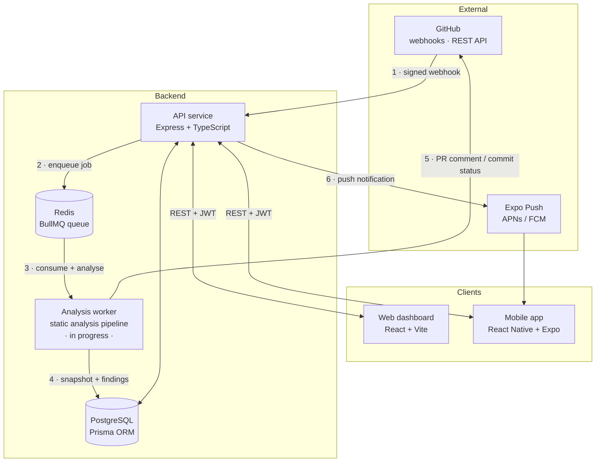

<div align="center">

# CodeHealth

**Automated Code Review & Technical Debt Tracking Dashboard**

Connect a GitHub repository, and every pull request is statically analysed in the background — producing a reproducible Health Score, a technical-debt estimate in engineer-minutes, and a trend line that shows whether the codebase is getting better or worse over time.

[](https://nodejs.org)
[](https://www.typescriptlang.org)
[](https://expressjs.com)
[](https://docs.bullmq.io)
[](https://www.postgresql.org)
[](https://www.prisma.io)
[](https://react.dev)
[](https://expo.dev)
[](https://github.com/Code-Review-and-Debt-tracking-Dashboard/AutomaticCodereviewandDebtTracking/actions/workflows/ci.yml)

</div>

---

## Overview

Code quality decays quietly. Individual pull requests each look reasonable, but complexity creeps up, duplication spreads, and security smells accumulate until the cost of change becomes the team's main constraint. CodeHealth makes that decay visible and measurable.

When a pull request opens, GitHub fires a webhook. The API verifies it, records the analysis, and immediately enqueues a background job — the HTTP handler returns in milliseconds and never waits on analysis work. A separate worker clones the repository, runs a battery of language-appropriate static analysers, normalises every finding into a common shape, and computes two numbers: a **Health Score** (0–100) and a **Debt Score** (remediation minutes). Those land in Postgres as an immutable snapshot, so the dashboard can plot a real trend instead of a single point-in-time reading.

The scoring engine is **deterministic and rule-based by design**. Identical input always produces an identical score. There is no LLM anywhere in the analysis pipeline — a Health Score that changes between runs on unchanged code would be worthless as a quality gate, and unexplainable to the developer whose PR it blocked.

---

## Screenshots

> Images live in `docs/screenshots/`. Replace the placeholders below with real captures.

| | |
|---|---|
| **Dashboard** — Health Score, debt summary, recent activity<br> | **Repository overview** — score breakdown by category<br> |
| **Findings** — filterable issue list with severity and rule<br> | **Trends** — Health Score and debt over time<br> |
| **Quality gate** — pass/fail thresholds per repository<br> | **Mobile app** — score at a glance and push notifications<br> |

<details>
<summary><b>Screenshots still to capture</b></summary>

Save each as a PNG in `docs/screenshots/` using exactly these filenames:

| Filename | What to capture | Where |
|---|---|---|
| `dashboard.png` | Main dashboard after login, with at least one linked repo | `/dashboard` |
| `repository-overview.png` | A single repository's Health Score and category breakdown | `/repositories/:id` |
| `findings.png` | The findings list, ideally with a severity filter applied | `/repositories/:id/findings` |
| `trends.png` | The Health Score trend chart with several data points | `/repositories/:id/trends` |
| `quality-gate.png` | The quality gate threshold configuration form | `/repositories/:id/quality-gate` |
| `mobile.png` | Mobile home screen — a device-framed capture looks best | Expo Go / simulator |
| `login.png` | *Optional* — the GitHub OAuth login screen | `/login` |
| `architecture.png` | *Optional* — a rendered version of the diagram below | — |

The first six are wired into the table above and will show as broken images until the files exist — add them before pushing to a branch anyone will see. The optional two aren't referenced anywhere yet; drop them in and link them if you want.

Two tips: capture at a consistent browser width (1440px works well) so the images line up in the table, and use a demo account with realistic data — empty states undersell the project.

</details>

---

## Architecture



**How a pull request becomes a score**

1. A PR is opened or updated. GitHub POSTs to `/webhooks/github` with an `X-Hub-Signature-256` header.
2. The API verifies that HMAC against the raw request body — before any JSON parsing — and rejects mismatches with `401`.
3. It writes a `pending` `AnalysisJob` row — so the analysis has an ID before any work starts — pushes the job onto the BullMQ `analysis-queue`, then returns `202`. If Redis is unreachable the row is marked `failed` rather than left pending forever. Total handler time: milliseconds.
4. The worker picks the job up, shallow-clones the commit, detects the languages present, and runs the matching analysers.
5. Every tool's output — ESLint JSON, Bandit JSON, Radon, jscpd — is normalised into one common `Finding` shape so downstream code never has to care which tool produced what.
6. The scoring engine turns those findings into a Health Score and a Debt Score, persisted as an immutable `HealthSnapshot`.
7. If the repository has a quality gate and the snapshot fails it, the worker posts a failing commit status back to GitHub and the API dispatches a push notification.

The queue between step 3 and step 4 is the central architectural decision. Static analysis on a large repository can take minutes; GitHub times webhook deliveries out in seconds. Decoupling the two means a slow analysis can never cause a dropped webhook, and the worker can be scaled or restarted independently of the API.

---

## Features

**GitHub integration**
- OAuth sign-in — no passwords stored, ever
- Repository browsing and one-click linking, with the webhook registered automatically on link
- HMAC-SHA256 signature verification on every inbound webhook
- Organisation sync, so team structure mirrors GitHub

**Analysis pipeline**
- Multi-language static analysis: JavaScript/TypeScript (ESLint + `eslint-plugin-security`), Python (Bandit, PyLint, Radon), Java (Checkstyle, PMD), C/C++ (Cppcheck), plus cross-language duplication detection (jscpd)
- Findings normalised into a single shape across every tool
- Five finding categories — vulnerability, complexity, duplication, code smell, maintainability — each with its own weighting

**Scoring and gating**
- Health Score (0–100) with diminishing returns per repeated rule, so one noisy lint rule can't dominate
- Debt Score expressed in engineer-minutes, using a per-category remediation cost table
- Lines-of-code normalisation so large and small repositories are compared fairly
- Configurable per-repository quality gates that block merges via GitHub commit status

**Dashboard**
- Health Score, debt, and trend charts per repository
- Filterable findings explorer with severity, category, and file drill-down
- Debt hotspots — the files carrying the most remediation cost
- Per-PR analysis view, organisation and repository member management
- Multi-tenant: organisation and repository-scoped role checks on every route

**Mobile**
- GitHub OAuth login with the JWT held in Expo SecureStore
- Score at a glance and a notifications inbox
- Push notifications on quality gate failures

**Platform**
- Full monorepo type safety — the queue payload contract is a shared TypeScript interface imported by both producer and consumer, so the two cannot drift
- Bull Board queue dashboard behind basic auth for operational visibility
- Structured JSON logging via Pino
- CI runs lint and type-check across every workspace on push and PR

---

## Tech stack

| Layer | Technology |
|---|---|
| **Language** | TypeScript (strict) on Node.js 20 |
| **API** | Express 4, Helmet, CORS, Pino structured logging |
| **Queue** | BullMQ 5 on Redis 7, with Bull Board for inspection |
| **Database** | PostgreSQL 16 via Prisma ORM |
| **Auth** | GitHub OAuth 2.0, JWT access tokens, database-backed rotating refresh tokens |
| **VCS** | Octokit (GitHub REST) |
| **Analysis** | ESLint, eslint-plugin-security, Bandit, PyLint, Radon, Checkstyle, PMD, Cppcheck, jscpd |
| **Web** | React 19, Vite, Tailwind CSS 4, TanStack Query, React Router 7, Recharts, Framer Motion |
| **Mobile** | React Native 0.86 + Expo SDK 57, React Navigation 7, Expo SecureStore |
| **Tooling** | npm workspaces, Docker Compose, GitHub Actions, oxlint |

---

## Project status

This is an active university group project. Honest state of play:

| Component | Status | Notes |
|---|---|---|
| Monorepo, CI, Docker Compose | ✅ Implemented | Lint + type-check across all workspaces on every PR |
| Database schema | ✅ Implemented | 14 Prisma models covering users, orgs, repos, analyses, findings, gates, notifications |
| Authentication | ✅ Implemented | GitHub OAuth, JWT, rotating refresh tokens, encrypted token storage |
| Multi-tenancy & RBAC | ✅ Implemented | Platform, organisation, and repository-level access middleware |
| Webhook receiver | ✅ Implemented | HMAC verification, analysis record, job enqueue |
| REST API | ✅ Implemented | Repos, orgs, snapshots, findings, quality gates, notifications |
| Job queue | ✅ Implemented | BullMQ producer side + shared payload contract + Bull Board |
| Web dashboard | ✅ Implemented | Auth flow, layout, repository and organisation views |
| Mobile app | ✅ Implemented | OAuth login, home, notifications |
| **Analysis worker** | 🚧 **In progress** | Queue consumer, clone, and analyser orchestration |
| **Scoring engine** | 📋 **Designed, not built** | Formula fully specified in `docs/scoring_algorithm.md` |
| PR comments & commit status | 📋 Planned | Depends on the worker |
| Push notifications | 📋 Planned | Device registration modelled; dispatch not wired |

---

## Repository structure

```
.
├── apps/
│   ├── api/                    Express API service
│   │   └── src/
│   │       ├── config/         Typed, validated environment loading
│   │       ├── lib/            JWT, crypto, cookies, Redis, queue, logger
│   │       ├── middleware/     Auth, RBAC, webhook signature, validation, errors
│   │       ├── routes/         HTTP layer — thin, delegates to services
│   │       └── services/       Business logic and all database access
│   ├── worker/                 BullMQ consumer + analysis pipeline (in progress)
│   ├── web/                    React + Vite dashboard
│   │   └── src/
│   │       ├── app/            Router, providers, shell
│   │       ├── components/     Layout, auth guards, shared UI
│   │       ├── contexts/       Auth and organisation context
│   │       ├── lib/            API client, token store
│   │       └── pages/          Route-level views
│   └── mobile/                 React Native + Expo app
├── packages/
│   ├── db/                     Prisma schema, migrations, client re-export
│   └── shared/                 Types shared across apps (queue job contract)
├── docs/                       Design documents and specifications
├── docker-compose.yml          PostgreSQL + Redis for local development
└── .github/workflows/ci.yml    Lint and type-check pipeline
```

The API deliberately keeps routes thin. Route files handle HTTP concerns — parsing, status codes, response shaping — and everything else lives in `services/`. Nothing outside a service touches Prisma directly, which keeps the data layer swappable and the business logic testable without spinning up Express.

---

## Getting started

### Prerequisites

- Node.js 20+ and npm 10+
- Docker and Docker Compose
- Python 3.10+ and pip — the worker shells out to PyLint (`python3 -m pip install -r apps/worker/requirements.txt`)
- A GitHub account (for creating an OAuth App)

### 1. Clone and install

```bash
git clone https://github.com/Code-Review-and-Debt-tracking-Dashboard/AutomaticCodereviewandDebtTracking.git
cd AutomaticCodereviewandDebtTracking
npm ci
```

npm workspaces installs every app and package from the root. Do not run `npm install` inside a workspace directory.

### 2. Start the infrastructure

```bash
docker compose up -d
```

This brings up PostgreSQL on host port **5433** and Redis on host port **6380**. Non-default ports are intentional — they avoid colliding with any Postgres or Redis you already have running locally.

```bash
docker compose ps          # both services should report (healthy)
```

### 3. Create a GitHub OAuth App

Go to **Settings → Developer settings → OAuth Apps → New OAuth App**:

| Field | Value |
|---|---|
| Application name | CodeHealth (local) |
| Homepage URL | `http://localhost:5173` |
| Authorization callback URL | `http://localhost:4000/auth/github/callback` |

Keep the Client ID and generated Client Secret for the next step.

### 4. Configure environment

```bash
cp apps/api/.env.example apps/api/.env
```

Generate the two secrets:

```bash
# JWT_SECRET
node -e "console.log(require('crypto').randomBytes(32).toString('hex'))"

# TOKEN_ENCRYPTION_KEY — must be exactly 64 hex characters
node -e "console.log(require('crypto').randomBytes(32).toString('hex'))"
```

Fill in `apps/api/.env`:

| Variable | Purpose |
|---|---|
| `PORT` | API port (default `4000`) |
| `DATABASE_URL` | Postgres connection string — port `5433` for the Compose setup |
| `REDIS_URL` | Redis connection string — port `6380` for the Compose setup |
| `GITHUB_CLIENT_ID` / `GITHUB_CLIENT_SECRET` | From your OAuth App |
| `GITHUB_OAUTH_CALLBACK_URL` | Must match the OAuth App exactly |
| `GITHUB_WEBHOOK_SECRET` | Shared secret used to verify inbound webhook signatures |
| `GITHUB_WEBHOOK_URL` | Public URL GitHub delivers to — a tunnel URL in local development |
| `JWT_SECRET` | Signs access tokens and the OAuth `state` parameter |
| `TOKEN_ENCRYPTION_KEY` | 64 hex chars; AES-256-GCM key for GitHub tokens at rest |
| `WEB_APP_URL` / `WEB_APP_ORIGINS` | Where OAuth redirects to, and the CORS allow-list |
| `ACCESS_TOKEN_EXPIRES_IN` | Access token lifetime (default `15m`) |
| `REFRESH_TOKEN_TTL_DAYS` | Refresh token lifetime (default `7`) |
| `COOKIE_SECURE` / `COOKIE_SAMESITE` | Refresh cookie flags — `false` / `lax` for local HTTP |
| `ENABLE_DEV_LOGIN` | Enables `POST /auth/dev-login`; ignored when `NODE_ENV=production` |
| `ADMIN_BASIC_AUTH_USER` / `_PASSWORD` | Protects the Bull Board dashboard |

### 5. Set up the database

```bash
npm run db:migrate --workspace packages/db
npm run generate   --workspace packages/db
```

### 6. Run the apps

```bash
npm run dev --workspace apps/api     # http://localhost:4000
npm run dev --workspace apps/web     # http://localhost:5173
npm run start --workspace apps/mobile   # Expo — scan the QR code
```

Check that the API is alive and connected:

```bash
curl http://localhost:4000/health
```

The queue dashboard is at `http://localhost:4000/admin/queues`, behind the basic-auth credentials you set.

### 7. Receive webhooks locally

GitHub can't reach `localhost`, so expose the API through a tunnel and point `GITHUB_WEBHOOK_URL` at it:

```bash
ngrok http 4000
# then set GITHUB_WEBHOOK_URL=https://<your-id>.ngrok.io/webhooks/github and restart the API
```

Linking a repository through the dashboard registers the webhook on that URL automatically.

---

## API reference

All `/api/*` routes require a `Bearer` access token. Repository and organisation routes additionally enforce membership and role.

### Authentication

| Method | Endpoint | Description |
|---|---|---|
| `GET` | `/auth/github` | Begin the OAuth flow (redirects to GitHub) |
| `GET` | `/auth/github/callback` | OAuth callback — issues tokens, redirects to the web app |
| `POST` | `/auth/refresh` | Rotate the refresh cookie, return a new access token |
| `POST` | `/auth/logout` | Revoke the session and clear the cookie |
| `GET` | `/auth/me` | Current authenticated user |
| `POST` | `/auth/dev-login` | Development only — sign in without GitHub |

### Organisations

| Method | Endpoint | Description |
|---|---|---|
| `GET` | `/api/orgs` | Organisations the caller belongs to |
| `POST` | `/api/orgs/sync` | Re-sync organisations and membership from GitHub |
| `GET` | `/api/orgs/:orgId/members` | Organisation members and roles |
| `GET` | `/api/orgs/:orgId/repos` | Repositories linked under an organisation |

### Repositories

| Method | Endpoint | Description |
|---|---|---|
| `GET` | `/api/repos/available` | GitHub repositories available to link |
| `POST` | `/api/repos` | Link a repository and register its webhook |
| `GET` | `/api/repos/:repoId` | Repository detail with its latest snapshot |
| `GET` | `/api/repos/:repoId/trend` | Health Score history for charting |
| `GET` | `/api/repos/:repoId/debt` | Technical debt breakdown |
| `GET` | `/api/repos/:repoId/hotspots` | Files carrying the most debt |
| `GET` | `/api/repos/:repoId/pulls` | Analysed pull requests |
| `GET` | `/api/repos/:repoId/pulls/:prNumber` | Single pull request analysis |
| `GET` | `/api/repos/:repoId/members` | Repository members |
| `POST` | `/api/repos/:repoId/members` | Add a member |
| `DELETE` | `/api/repos/:repoId/members/:userId` | Remove a member |

### Analysis, gates, and notifications

| Method | Endpoint | Description |
|---|---|---|
| `GET` | `/api/snapshots/:snapshotId/findings` | Findings for a snapshot, filterable |
| `GET` | `/api/repos/:repoId/quality-gate` | Current quality gate thresholds |
| `PUT` | `/api/repos/:repoId/quality-gate` | Update thresholds |
| `GET` | `/api/notifications` | Notification inbox |
| `PUT` | `/api/notifications/:notificationId/read` | Mark one as read |
| `PUT` | `/api/notifications/read-all` | Mark all as read |

### System

| Method | Endpoint | Description |
|---|---|---|
| `GET` | `/health` | Liveness and dependency check |
| `POST` | `/webhooks/github` | GitHub webhook receiver — HMAC verified, no auth token |
| `DELETE` | `/api/admin/users/:userId/sessions` | Revoke all of a user's sessions (platform admin) |
| — | `/admin/queues` | Bull Board queue dashboard (basic auth) |

---

## The Health Score

The score is penalty-based: start at 100 and deduct for each finding.

```
findingPenalty = 0.5 × categoryWeight × severityMultiplier × diminishingFactor
totalPenalty   = (Σ findingPenalties × locScaleFactor) + duplicationPenalty
healthScore    = max(0, 100 − totalPenalty)
```

| Category | Weight | | Severity | Multiplier |
|---|---|---|---|---|
| Vulnerability | 4.0 | | Critical | 3.0 |
| Complexity | 2.0 | | High / error | 2.0 |
| Duplication | 1.5 | | Medium / warning | 1.0 |
| Maintainability | 1.5 | | Low | 0.5 |
| Code smell | 1.0 | | Info | 0.25 |

Three refinements stop the raw formula from producing misleading numbers:

- **Diminishing returns.** The *N*th occurrence of the same rule is weighted `1 / (1 + 0.3 × (N − 1))`. Without this, fifty instances of one trivial lint rule would sink a repository's score further than a single SQL injection.
- **LOC normalisation.** Above 1000 lines, finding penalties scale by `1000 / linesOfCode`, so a 10,000-line repo with 50 findings scores the same as a 1,000-line repo with 5.
- **Continuous duplication penalty.** jscpd reports a percentage rather than discrete findings, so duplication is charged as `duplicationPct × 0.45` instead of per-finding.

Alongside the score, a **Debt Score** sums a per-category, per-severity remediation cost table into total engineer-minutes — from 60 minutes for a critical vulnerability down to 1 minute for an informational code smell. Debt is additive with no diminishing returns: every finding genuinely costs time to fix, however many siblings it has.

Full derivation and rationale: [`docs/scoring_algorithm.md`](docs/scoring_algorithm.md).

---

## Security

| Concern | Approach |
|---|---|
| Webhook authenticity | HMAC-SHA256 over the **raw** body, compared in constant time. The webhook router is mounted before `express.json()` so the byte-exact payload is still available. |
| GitHub tokens at rest | AES-256-GCM encrypted before being written to the database. The key never leaves the environment. |
| Session management | Short-lived JWT access tokens (15 min) paired with database-backed refresh tokens. Access tokens can't be revoked, so the refresh record is what actually controls session lifetime — and it rotates on every use. |
| Refresh token transport | `httpOnly` cookie with configurable `Secure` and `SameSite`, never exposed to JavaScript. |
| OAuth CSRF | The `state` parameter is a signed, single-use nonce stored in Redis and bound to the originating browser, so a stolen callback URL is useless. |
| Token confusion | Access tokens and OAuth state tokens carry distinct `typ` claims, so neither can be replayed as the other. |
| Authorisation | Layered middleware — platform role, organisation membership, repository role — applied per route rather than assumed globally. |
| Transport hardening | Helmet security headers; CORS restricted to an explicit origin allow-list, because credentialed requests reject wildcards. |
| Secrets | Never committed. `.env.example` documents every variable and ships generate-commands instead of values. |

---

## Continuous integration

[`.github/workflows/ci.yml`](.github/workflows/ci.yml) runs on every push and pull request against `main` and `develop`:

1. Install with `npm ci` from the lockfile
2. Generate the Prisma Client — its output is gitignored, so anything importing `@codehealth/db` fails to type-check without this step
3. Lint every workspace
4. Type-check every workspace

---

## Roadmap

- [ ] Analysis worker — queue consumer, shallow clone, language detection
- [ ] Analyser adapters and the normalised `Finding` mapping layer
- [ ] Scoring engine implementing the specified formula
- [ ] Snapshot persistence and trend aggregation
- [ ] PR comment and commit status write-back via Octokit
- [ ] Quality gate enforcement on the GitHub check
- [ ] Expo push notification dispatch
- [ ] Worker unit tests with fixture repositories
- [ ] Container images and deployment pipeline

---

## Documentation

Design documents in [`docs/`](docs/) cover the work that preceded implementation:

| Document | Contents |
|---|---|
| [`system_architecture.md`](docs/system_architecture.md) | Component design, data flow, deployment topology |
| [`database_design.md`](docs/database_design.md) | Entity model, relationships, indexing |
| [`api_design.md`](docs/api_design.md) | Endpoint contracts and response shapes |
| [`scoring_algorithm.md`](docs/scoring_algorithm.md) | Health Score and Debt Score derivation |
| [`requirements_analysis.md`](docs/requirements_analysis.md) | Functional and non-functional requirements |
| [`tool_matrix.md`](docs/tool_matrix.md) | Static analysis tool selection and rationale |
| [`ui_wireframes.md`](docs/ui_wireframes.md) | Interface design |
| [`project_plan.md`](docs/project_plan.md) | Work breakdown and schedule |

---

## About

Built for **Software Engineering Project**, Department of Computer Science & Engineering, University of Moratuwa.
