<div align="center">

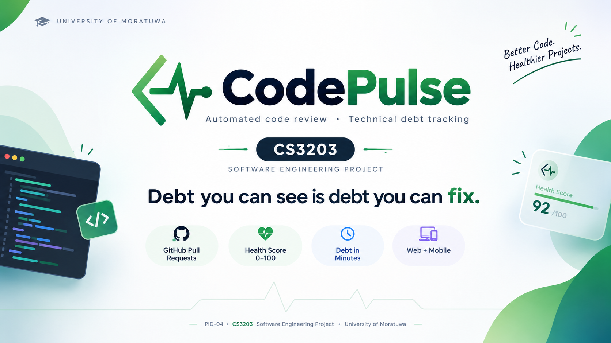

**Every pull request gets a reproducible Health Score, a technical debt estimate, and a comment on the PR.**

[](https://github.com/Code-Review-and-Debt-tracking-Dashboard/AutomaticCodereviewandDebtTracking/actions/workflows/ci.yml)


[Overview](#overview) · [Screenshots](#screenshots) · [How it works](#how-it-works) · [Health Score](#health-score) · [Getting started](#getting-started) · [Team](#team)

</div>

---

## Overview

Code quality usually declines slowly. Each pull request looks fine on its own, but complexity, duplication and security smells build up over time. CodePulse connects to GitHub and analyses every pull request in the background. It turns the findings into two numbers, a **Health Score (0–100)** and a **technical debt estimate in minutes**, and keeps every run so teams can see the trend.

- **Deterministic.** Rule-based static analysis only, with no LLM anywhere. The same commit always gets the same score.
- **Never blocks GitHub.** The webhook handler only verifies the request and queues a job. Analysis runs in a separate worker.
- **Feedback on the PR.** One bot comment, edited in place, plus a pass/fail `codepulse/quality-gate` commit status.
- **Web and mobile.** A React dashboard for details and an Expo app with push alerts when a score drops.

## Screenshots

| | |
|---|---|
| **Dashboard**<br>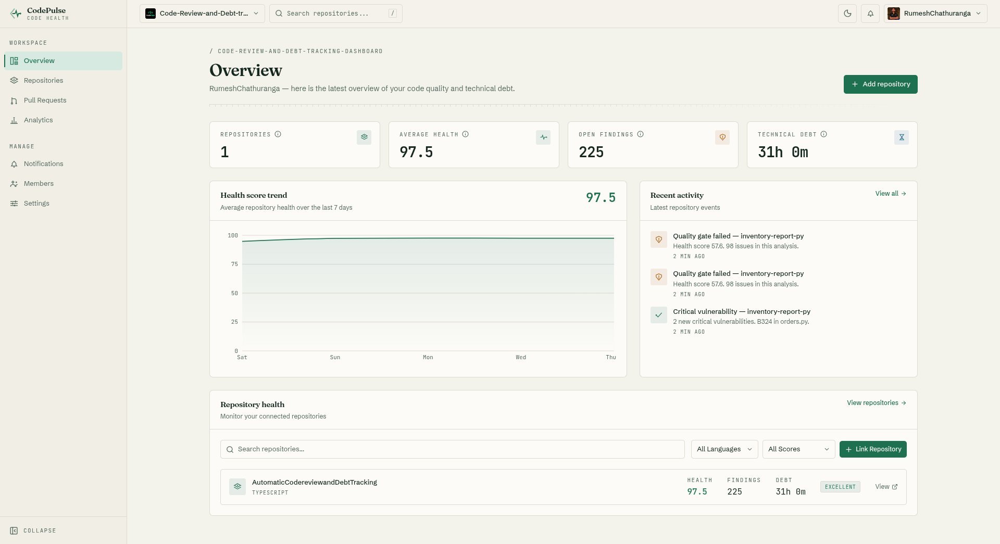 | **Repository overview**<br>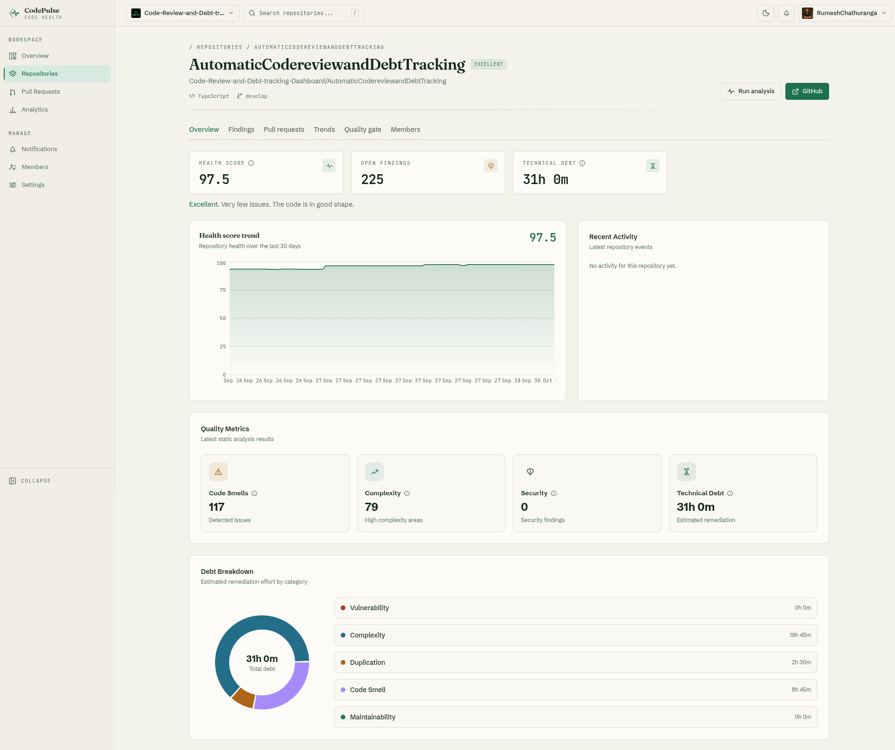 |
| **Findings**<br>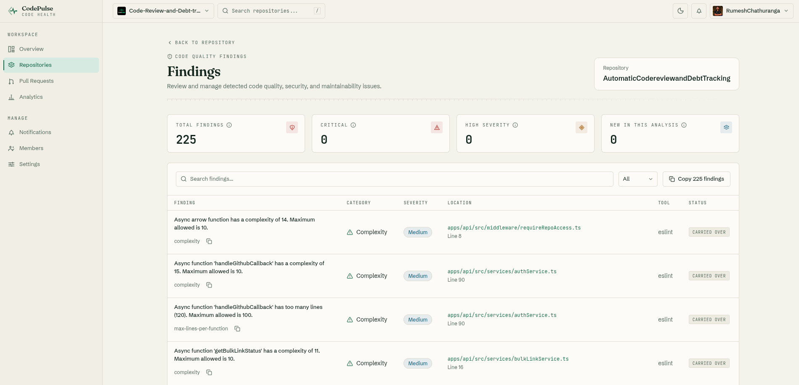 | **Trends**<br>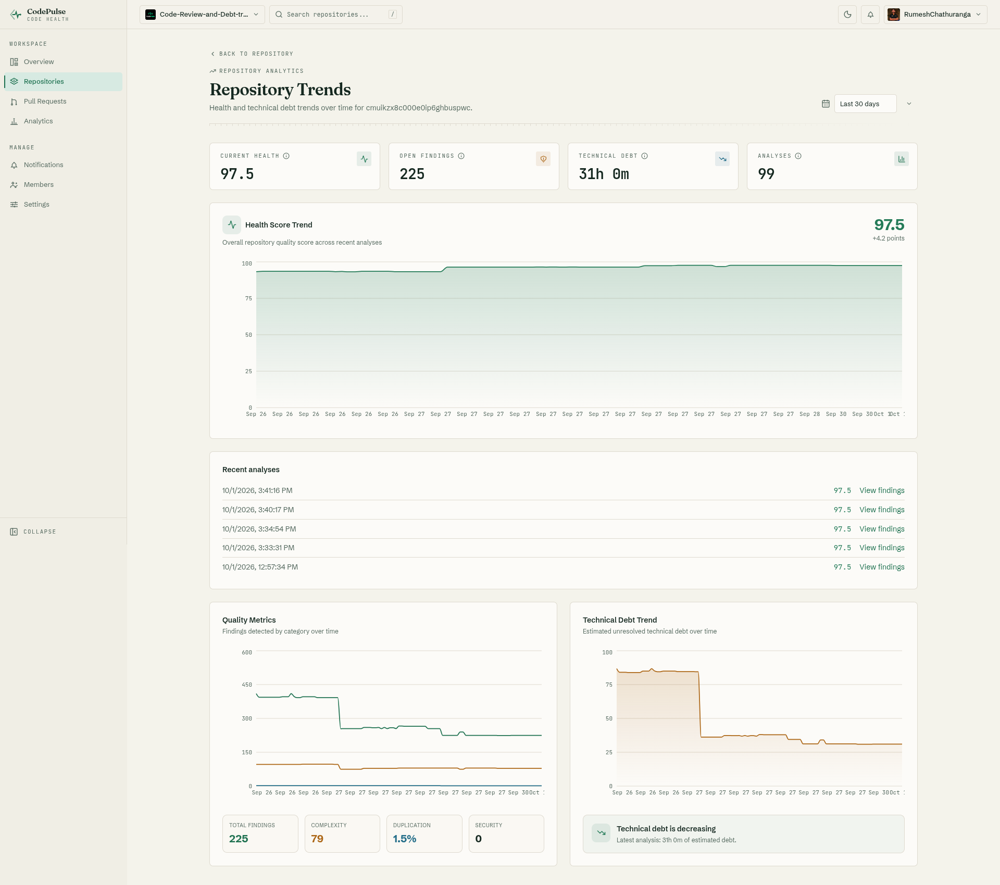 |
| **Quality gate**<br>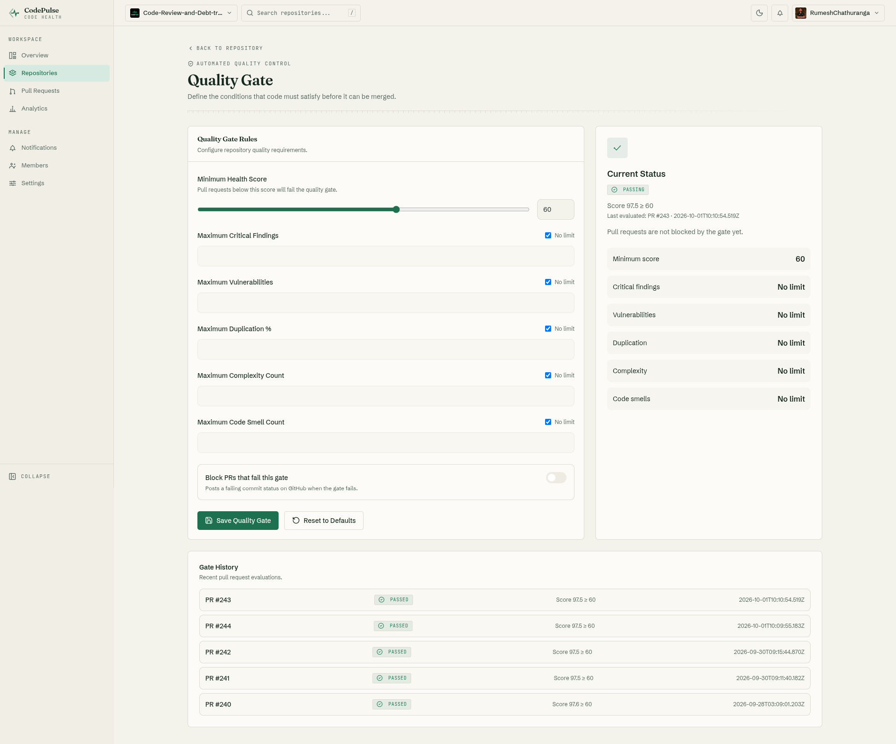 | **Comment on the pull request**<br>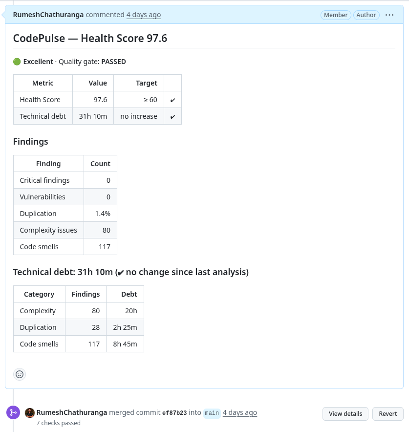 |

**Mobile app**: overview, repository summary, notifications and profile

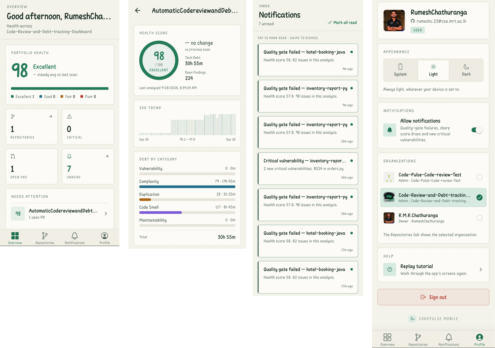

## How it works

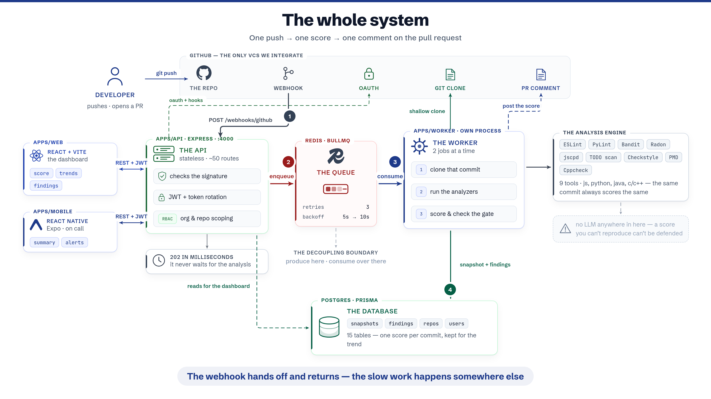

1. A developer opens or updates a pull request, and GitHub sends a signed webhook to the API.
2. The API checks the HMAC signature against the raw body, writes a `PENDING` analysis row, queues a BullMQ job and replies `202` within milliseconds.
3. The worker takes the job, makes a shallow clone of the commit, detects the languages and runs the matching analysers.
4. Findings are normalised into one shape, compared with the previous run (new / still there / fixed) and scored.
5. The worker checks the quality gate and sends the results to the API. The API saves the snapshot and findings in one transaction and sends any push alerts. Then the worker posts the PR comment and commit status.

The queue is the key design decision. GitHub expects a webhook reply within about 10 seconds, but a real analysis can take minutes. Separating the two means a slow analysis never causes a dropped webhook, and failed jobs are retried (3 attempts with backoff).

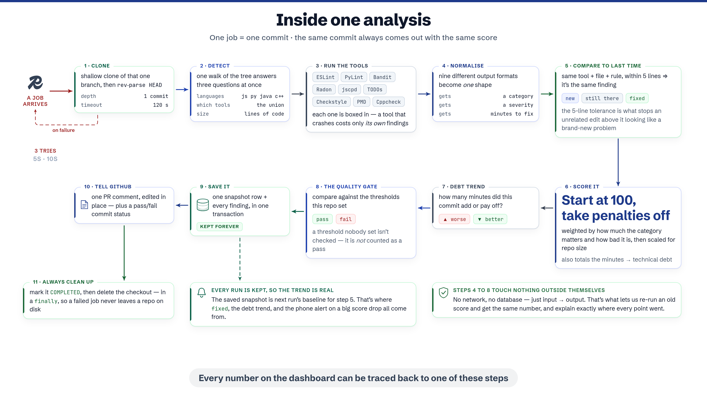

## Features

| Area | What it does |
|---|---|
| **GitHub** | OAuth sign-in, org sync, one-click repo linking with automatic webhook setup, bulk linking |
| **Analysis** | ESLint + security plugins (JS/TS), PyLint, Bandit and Radon (Python), Checkstyle and PMD (Java), Cppcheck (C/C++), jscpd (duplication), TODO/FIXME scan |
| **Scoring** | Health Score, debt in minutes, debt trend per commit, configurable per-repo quality gates |
| **Dashboard** | Score and debt trends, a filterable findings explorer, debt hotspots, per-PR results, member management |
| **Mobile** | GitHub login, repo summaries, a notifications inbox, push alerts on gate failures, score drops and critical findings |
| **Security** | HMAC webhook verification, AES-256-GCM encrypted GitHub tokens, rotating refresh tokens with reuse detection, rate limits |
| **Access control** | Platform, organisation and repository roles. Repos outside your org return `404`, not `403`, so they don't reveal that they exist |

## Health Score

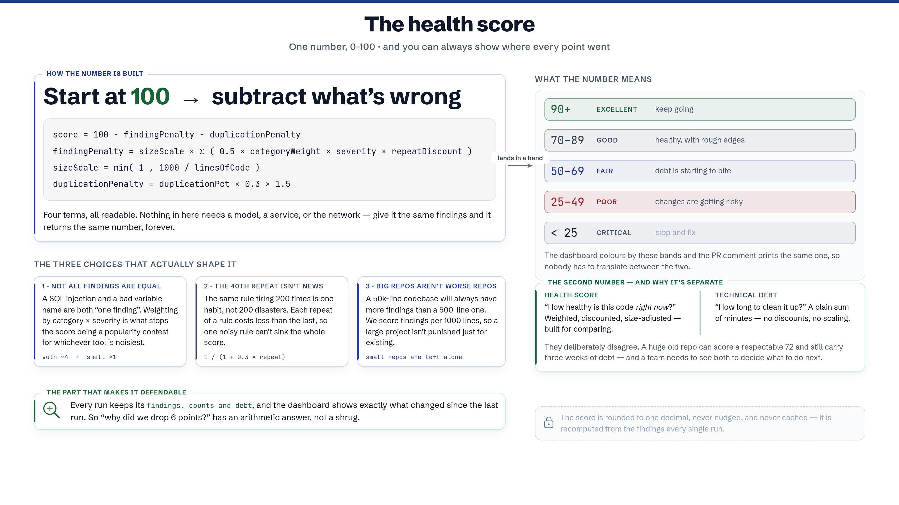

```
score              = 100 − findingPenalty − duplicationPenalty
findingPenalty     = sizeScale × Σ (0.5 × categoryWeight × severity × repeatDiscount)
sizeScale          = min(1, 1000 / linesOfCode)
duplicationPenalty = duplicationPct × 0.3 × 1.5
```

- **Category weights:** vulnerability 4.0, complexity 2.0, duplication 1.5, maintainability 1.5, code smell 1.0
- **Severity multipliers:** critical 3.0, high 2.0, medium 1.0, low 0.5, info 0.25
- **Repeat discount:** the *n*th hit of the same rule counts `1 / (1 + 0.3 × (n − 1))`, so one noisy rule can't sink the score

Technical debt is kept separate. It is a plain sum of fix-time minutes per finding, with no discounts and no size scaling.

## Tech stack

| Layer | Technology |
|---|---|
| API | Node.js 20, TypeScript, Express 4, Zod, Pino, Helmet |
| Queue | BullMQ 5 on Redis 7, Bull Board |
| Database | PostgreSQL 16, Prisma 7 |
| GitHub | Octokit, GitHub OAuth, webhooks |
| Web | React 19, Vite, Tailwind CSS 4, TanStack Query, React Router 7, Recharts |
| Mobile | React Native 0.86, Expo SDK 57, React Navigation 7, Expo Notifications |
| Testing | Vitest, Supertest, Testing Library |
| DevOps | Docker Compose, GitHub Actions, Caddy, AWS EC2, EAS Update |

## Project structure

```
apps/
  api/          Express API: routes, services, auth and access middleware
  worker/       BullMQ consumer: clone → analyse → score → gate → report
  web/          React + Vite dashboard
  mobile/       React Native + Expo app
packages/
  db/           Prisma schema, migrations, seed
  shared/       Types shared by API and worker (queue payloads, findings)
  github/       Shared GitHub helpers (repo linking)
deploy/         Caddy reverse proxy for production
scripts/        dev.sh (local stack), deploy.sh (production)
assets/         README diagrams and screenshots
```

## Getting started

**Prerequisites:** Node.js 20+, Docker, and a GitHub OAuth App with the callback `http://localhost:4000/auth/github/callback`. Running every analyser locally also needs Python 3 (`pip install -r apps/worker/requirements.txt`), Java 21 and Cppcheck. If a tool is missing, only that tool's findings are skipped.

```bash
# 1. install
npm ci

# 2. Postgres on :5433 and Redis on :6380
docker compose up -d

# 3. config: fill in the values, each file explains its variables
cp apps/api/.env.example apps/api/.env
cp apps/worker/.env.example apps/worker/.env

# 4. database
npm run db:migrate --workspace packages/db
npm run db:seed    --workspace packages/db

# 5. run everything (api, worker, web, ngrok)
./scripts/dev.sh start
```

To run services one at a time instead, use `npm run dev --workspace apps/api` (and the same for `apps/worker` and `apps/web`). Start the mobile app with `npm run start --workspace apps/mobile`.

| Service | URL |
|---|---|
| Web dashboard | http://localhost:5173 |
| API health check | http://localhost:4000/health |
| Queue dashboard | http://localhost:4000/admin/queues |

GitHub can't reach `localhost`, so webhooks need a tunnel. Set `GITHUB_WEBHOOK_URL` to your ngrok URL and the repos you link will use it.

## Testing and CI

```bash
npm test                              # all workspaces
npm run test --workspace apps/api     # API integration tests (needs docker compose)
npm run test --workspace apps/worker  # worker unit tests
```

API tests run against a separate `code_review_test` database and never touch dev data. A cross-tenant test calls every `:repoId`, `:orgId` and `:snapshotId` route with another organisation's token and expects `404`.

GitHub Actions runs lint, type-check and the API and worker test suites on every push and PR to `main` and `develop`. A merge to `main` also deploys to production and then runs a health check.

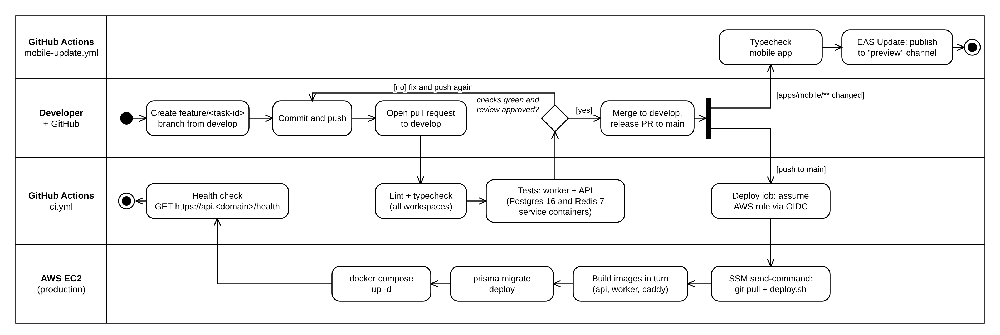

## Deployment

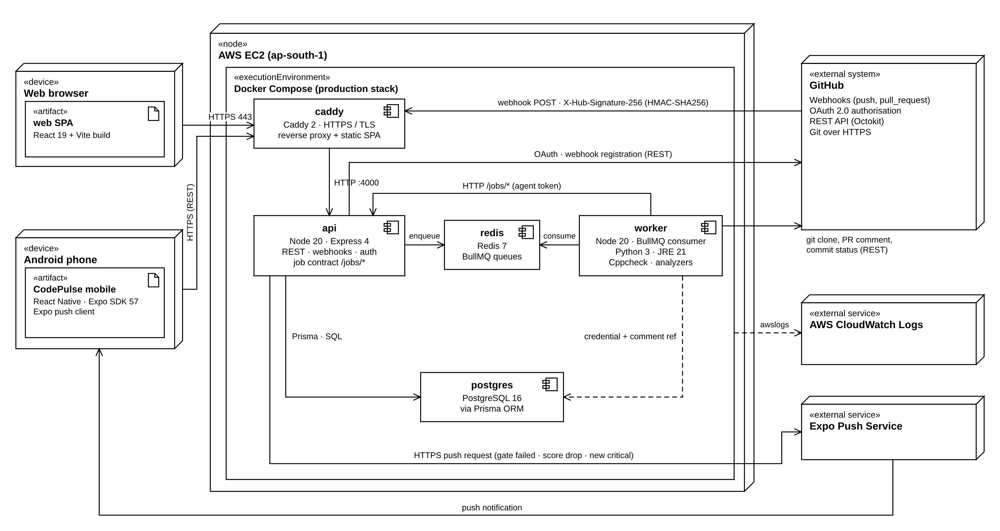

Production runs on one AWS EC2 instance as the Docker Compose stack in `docker-compose.prod.yml`. Caddy terminates HTTPS, serves the web app and proxies to the API. Only Caddy is reachable from outside. CI connects over AWS SSM and runs `scripts/deploy.sh`, which rebuilds the images, applies Prisma migrations, then restarts the stack. Container logs go to CloudWatch, and mobile JavaScript changes go out over the air through EAS Update.

## Team

| Member | Main area |
|---|---|
| [@RumeshChathuranga](https://github.com/RumeshChathuranga) | API, worker |
| [@Bhagyatgn](https://github.com/Bhagyatgn) | Web dashboard, database |
| [@vidushiDew](https://github.com/vidushiDew) | Mobile app, database |

---

<div align="center">
<sub>PID-04 · CS3203 Software Engineering Project · Department of Computer Science & Engineering, University of Moratuwa</sub>
</div>
