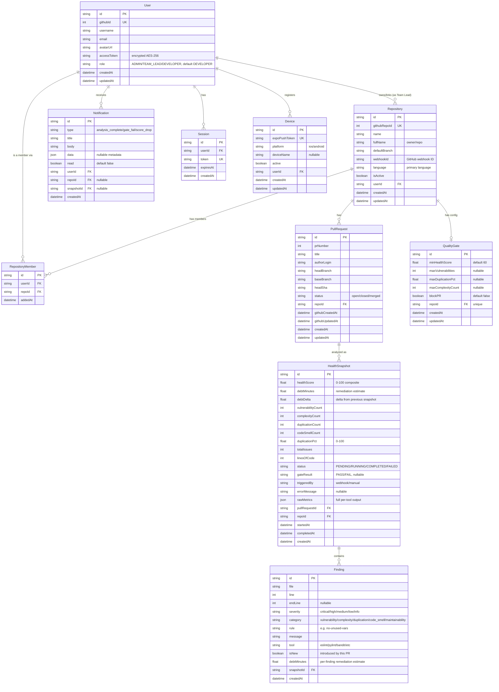

# Database Design Document

> **Project:** Automated Code Review & Technical Debt Tracking Dashboard (PID 4)
> **Module:** CS3023 — University of Moratuwa
> **Date:** 21 June 2026
> **ORM:** Prisma 5.x | **Database:** PostgreSQL 15+

---

## 1. Entity-Relationship Diagram



---

## 2. Prisma Schema

The full schema is in [`packages/db/prisma/schema.prisma`](file:///home/rumeshchathuranga/Documents/SEproject/AutomaticCodereviewandDebtTracking/packages/db/prisma/schema.prisma).

```prisma
// ─── datasource & generator ────────────────────────────────────────

datasource db {
  provider = "postgresql"
  url      = env("DATABASE_URL")
}

generator client {
  provider = "prisma-client-js"
}

// ─── enums ─────────────────────────────────────────────────────────

enum AnalysisStatus {
  PENDING
  RUNNING
  COMPLETED
  FAILED
}

enum Severity {
  CRITICAL
  HIGH
  MEDIUM
  LOW
  INFO
}

enum FindingCategory {
  VULNERABILITY
  COMPLEXITY
  DUPLICATION
  CODE_SMELL
  MAINTAINABILITY
}

enum PRStatus {
  OPEN
  CLOSED
  MERGED
}

enum UserRole {
  ADMIN      // platform administrator — sees all repos, access to /api/metrics
  TEAM_LEAD  // links/unlinks repos, configures quality gates, manages members
  DEVELOPER  // read-only access to repos they are a member of
}

enum GateResult {
  PASS
  FAIL
}

// ─── models ────────────────────────────────────────────────────────

model User {
  id            String              @id @default(cuid())
  githubId      Int                 @unique
  username      String
  email         String?
  avatarUrl     String?
  accessToken   String              // encrypted at rest (AES-256)
  role          UserRole            @default(DEVELOPER)
  repositories  Repository[]        // repos this user owns (as Team Lead)
  memberships   RepositoryMember[]  // repos this user has been added to
  notifications Notification[]
  sessions      Session[]
  devices       Device[]
  createdAt     DateTime            @default(now())
  updatedAt     DateTime            @updatedAt
}

model Session {
  id        String   @id @default(cuid())
  token     String   @unique
  userId    String
  user      User     @relation(fields: [userId], references: [id], onDelete: Cascade)
  expiresAt DateTime
  createdAt DateTime @default(now())

  @@index([token])
  @@index([userId])
}

model Repository {
  id            String              @id @default(cuid())
  githubRepoId  Int                 @unique
  name          String              // e.g. "my-project"
  fullName      String              // e.g. "username/my-project"
  defaultBranch String              @default("main")
  language      String?             // primary language detected by GitHub
  webhookId     String?             // GitHub webhook ID for cleanup on unlink
  isActive      Boolean             @default(true)

  userId        String              // owner (Team Lead) — linked the repo, controls gate config
  owner         User                @relation(fields: [userId], references: [id], onDelete: Cascade)

  members       RepositoryMember[]  // developers with read access to this repo

  pullRequests  PullRequest[]
  snapshots     HealthSnapshot[]
  qualityGate   QualityGate?
  notifications Notification[]

  createdAt     DateTime            @default(now())
  updatedAt     DateTime            @updatedAt

  @@index([userId])
  @@index([fullName])
}

// Connects a User (typically DEVELOPER role) to a Repository they can view.
// The owning Team Lead is implicitly a member via Repository.userId and does
// not need a row here. Created when a Team Lead adds a developer by GitHub
// username (POST /api/repos/:repoId/members).
model RepositoryMember {
  id      String     @id @default(cuid())
  userId  String
  user    User       @relation(fields: [userId], references: [id], onDelete: Cascade)
  repoId  String
  repository Repository @relation(fields: [repoId], references: [id], onDelete: Cascade)
  addedAt DateTime   @default(now())

  @@unique([userId, repoId])
  @@index([repoId])
}

model PullRequest {
  id              String           @id @default(cuid())
  prNumber        Int
  title           String
  authorLogin     String
  headBranch      String
  baseBranch      String
  headSha         String
  status          PRStatus         @default(OPEN)

  repoId          String
  repository      Repository       @relation(fields: [repoId], references: [id], onDelete: Cascade)

  snapshots       HealthSnapshot[]

  githubCreatedAt DateTime?
  githubUpdatedAt DateTime?
  createdAt       DateTime         @default(now())
  updatedAt       DateTime         @updatedAt

  @@unique([repoId, prNumber])
  @@index([repoId])
  @@index([status])
}

model HealthSnapshot {
  id                 String          @id @default(cuid())

  // ── core scores ──
  healthScore        Float           // composite 0-100
  debtMinutes        Float           @default(0) // total remediation estimate
  debtDelta          Float           @default(0) // delta vs previous snapshot on same repo

  // ── category counts ──
  vulnerabilityCount Int             @default(0)
  complexityCount    Int             @default(0)
  duplicationCount   Int             @default(0)
  codeSmellCount     Int             @default(0)
  duplicationPct     Float           @default(0) // 0-100

  // ── metadata ──
  totalIssues        Int             @default(0)
  linesOfCode        Int             @default(0)
  status             AnalysisStatus  @default(PENDING)
  gateResult         GateResult?     // PASS/FAIL — set by worker Stage 6 (GATE); null if no gate configured
  triggeredBy        String          @default("webhook") // "webhook" | "manual"
  errorMessage       String?
  rawMetrics         Json?           // full per-tool JSON output for debugging

  // ── relations ──
  pullRequestId      String?
  pullRequest        PullRequest?    @relation(fields: [pullRequestId], references: [id], onDelete: SetNull)

  repoId             String
  repository         Repository      @relation(fields: [repoId], references: [id], onDelete: Cascade)

  findings           Finding[]
  notifications      Notification[]

  startedAt          DateTime?
  completedAt        DateTime?
  createdAt          DateTime        @default(now())

  // ── indexes for trend queries and lookups ──
  @@index([repoId, createdAt(sort: Desc)])         // trend chart: scores over time for a repo
  @@index([pullRequestId])                          // find snapshots for a specific PR
  @@index([repoId, status])                         // find pending/running jobs per repo
  @@index([status])                                 // worker: find all pending jobs
  @@index([createdAt(sort: Desc)])                  // global recent analyses
}

model Finding {
  id           String          @id @default(cuid())
  file         String          // relative file path
  line         Int             // start line number
  endLine      Int?            // end line (nullable for single-line findings)
  severity     Severity
  category     FindingCategory
  rule         String          // e.g. "no-unused-vars", "B101"
  message      String
  tool         String          // "eslint" | "pylint" | "bandit" | "radon" | etc.
  isNew        Boolean         @default(true) // true = introduced by this PR
  debtMinutes  Float           @default(5)    // estimated fix time in minutes

  snapshotId   String
  snapshot     HealthSnapshot  @relation(fields: [snapshotId], references: [id], onDelete: Cascade)

  createdAt    DateTime        @default(now())

  @@index([snapshotId])                             // all findings for a snapshot
  @@index([snapshotId, category])                   // findings filtered by category
  @@index([snapshotId, severity])                   // findings filtered by severity
  @@index([snapshotId, isNew])                      // new vs carried-over findings
  @@index([snapshotId, file])                       // findings per file (hotspot analysis)
}

model QualityGate {
  id                String   @id @default(cuid())
  minHealthScore    Float    @default(60)    // minimum acceptable health score
  maxVulnerabilities Int?                     // max allowed vulnerability count (null = no limit)
  maxDuplicationPct Float?                    // max allowed duplication % (null = no limit)
  maxComplexityCount Int?                     // max allowed complexity finding count (null = no limit)
  blockPR           Boolean  @default(false)  // whether to post failing commit status

  repoId            String   @unique
  repository        Repository @relation(fields: [repoId], references: [id], onDelete: Cascade)

  createdAt         DateTime @default(now())
  updatedAt         DateTime @updatedAt
}

model Notification {
  id         String          @id @default(cuid())
  type       String          // "analysis_complete" | "gate_fail" | "score_drop"
  title      String
  body       String
  data       Json?           // optional metadata payload
  read       Boolean         @default(false)

  userId     String
  user       User            @relation(fields: [userId], references: [id], onDelete: Cascade)

  repoId     String?
  repository Repository?     @relation(fields: [repoId], references: [id], onDelete: SetNull)

  snapshotId String?
  snapshot   HealthSnapshot? @relation(fields: [snapshotId], references: [id], onDelete: SetNull)

  createdAt  DateTime        @default(now())

  @@index([userId, read, createdAt(sort: Desc)])   // user's unread notifications, most recent first
  @@index([userId, createdAt(sort: Desc)])          // all notifications for a user
}

model Device {
  id            String   @id @default(cuid())
  expoPushToken String   @unique
  platform      String   // "ios" | "android"
  deviceName    String?
  active        Boolean  @default(true)

  userId        String
  user          User     @relation(fields: [userId], references: [id], onDelete: Cascade)

  createdAt     DateTime @default(now())
  updatedAt     DateTime @updatedAt

  @@index([userId])
}
```

---

## 3. Design Rationale

### 3.1 Why `Finding` is a Separate Table (not JSON on Snapshot)

| Approach | Pros | Cons |
|---|---|---|
| JSON column on `HealthSnapshot` | Simpler write (one INSERT) | Cannot query individual findings efficiently; no filtering by severity/category/file without parsing JSON; no aggregation (e.g. "top files by finding count") |
| Separate `Finding` table | Full SQL queryability; can index by severity, category, file; supports dashboard features like file-level hotspot heatmaps, severity distribution charts, and per-rule trending | More rows; slightly more complex write (batch INSERT) |

**Decision:** Separate table. The dashboard's value proposition depends on slicing findings by file, severity, and category. A JSON blob would make these queries either impossible or require application-level filtering, which breaks down at scale and prevents PostgreSQL's query optimizer from helping.

The `rawMetrics` JSON column on `HealthSnapshot` stores the *full unprocessed tool output* as a debugging/audit trail — it is never queried by the application, only displayed verbatim when a developer wants the raw data.

### 3.2 How `isNew` is Determined

When the worker analyzes a PR:

1. It analyzes the **PR head branch** (the proposed code).
2. It compares findings against the **most recent completed snapshot on the same repository's default branch** (i.e., the last merge to `main`).
3. A finding is marked `isNew = true` if:
   - The same `(file, line, rule)` tuple does **not** exist in the baseline snapshot's findings.
   - OR the file is entirely new in the PR.
4. A finding is marked `isNew = false` if:
   - The same `(file, rule)` exists in the baseline (line numbers may shift slightly; we match on file+rule with a configurable line-proximity tolerance of ±5 lines).

This lets the PR comment say "3 new issues introduced, 12 pre-existing" — the developer only needs to fix what they broke.

### 3.3 How `debtDelta` is Calculated

```
debtDelta = current_snapshot.debtMinutes - previous_snapshot.debtMinutes
```

Where `previous_snapshot` is the most recent `COMPLETED` snapshot for the **same repository** (by `createdAt` order). The query:

```sql
SELECT "debtMinutes" FROM "HealthSnapshot"
WHERE "repoId" = $1 AND "status" = 'COMPLETED' AND "id" != $2
ORDER BY "createdAt" DESC
LIMIT 1
```

- **Positive debtDelta**: technical debt increased (bad)
- **Negative debtDelta**: technical debt decreased (good)
- **Zero or first snapshot**: debtDelta = 0

This is calculated at the end of the worker's SCORE stage and persisted on the snapshot row.

### 3.4 Why `PullRequest` is a Separate Entity

Rather than just storing `prNumber` on the snapshot, we track PRs as first-class entities because:

- The dashboard needs to show PR lists with metadata (title, author, branch, status)
- A single PR can have **multiple snapshots** (re-analyzed on each push to the PR branch)
- PR status tracking (open/closed/merged) enables filtering in the UI

The compound unique constraint `@@unique([repoId, prNumber])` prevents duplicates when multiple webhook events arrive for the same PR.

### 3.5 Why `HealthSnapshot` Has Both `pullRequestId` and `repoId`

- `pullRequestId` is **nullable** — manual/scheduled analyses target a repo, not a PR.
- `repoId` is **always set** — enables trend queries across ALL analyses for a repo (both PR-triggered and manual) without joining through PullRequest.
- The `@@index([repoId, createdAt(sort: Desc)])` index powers the trend chart directly.

### 3.6 `debtMinutes` Per-Finding Estimation

Each finding carries a `debtMinutes` field estimating remediation effort. Default values by severity:

| Severity | Default debtMinutes |
|---|---|
| CRITICAL | 30 |
| HIGH | 20 |
| MEDIUM | 10 |
| LOW | 5 |
| INFO | 2 |

The snapshot's `debtMinutes` is the **sum** of all its findings' `debtMinutes`. This gives a "remediation effort in minutes" metric that non-technical project managers can understand.

### 3.7 User Roles & `RepositoryMember`

The system has three roles, stored on `User.role`:

| Role | Can do | Sees |
|---|---|---|
| `ADMIN` | Everything a Team Lead can do, plus access `GET /api/metrics` (platform-wide operational stats) | All repositories, regardless of ownership/membership |
| `TEAM_LEAD` | Link/unlink repos, configure quality gates, trigger manual analysis, add/remove `RepositoryMember` rows on repos they own | Repos they own (`Repository.userId`) |
| `DEVELOPER` | Read-only: view findings, trends, hotspots; manage their own notifications and devices | Repos where a `RepositoryMember` row exists for them |

**Why a separate `RepositoryMember` join table instead of a role column directly on `Repository`:** ownership and membership are different relationships. `Repository.userId` identifies the single owner (always a `TEAM_LEAD`, enforced at the application layer, not the DB) who controls gate settings and can unlink the repo. `RepositoryMember` is a many-to-many table so a Team Lead can grant read access to multiple developers, and a developer can be a member of multiple repos owned by different Team Leads. The owner does **not** get a `RepositoryMember` row — ownership already implies full access, and duplicating it would mean two sources of truth to keep in sync.

Authorization check for "can this user see this repo":

```sql
SELECT 1 FROM "Repository" r
WHERE r."id" = $1
  AND (
    r."userId" = $2                                             -- is owner
    OR EXISTS (
      SELECT 1 FROM "RepositoryMember" m
      WHERE m."repoId" = r."id" AND m."userId" = $2              -- is member
    )
  )
-- OR the requesting user's role = 'ADMIN' (checked in application code, no query needed)
```

**Decision:** `role` defaults to `DEVELOPER` on signup. The first user of a deployment is expected to be promoted to `ADMIN` manually (there is no self-service admin signup — this mirrors how most internal tools bootstrap their first admin). Promoting a `TEAM_LEAD` happens implicitly: any `DEVELOPER` who links a repository via `POST /api/repos` is auto-upgraded to `TEAM_LEAD` on their first successful link, since owning a repo requires Team Lead permissions.

### 3.8 Why `Device` is Keyed to `User`, Not `Repository`

Push tokens belong to a physical device the user is signed in on, not to any single repository — the same device should receive notifications across every repo the user has access to. `Device.userId` cascades on delete so removing a user cleans up their registered devices automatically. `expoPushToken` is globally unique because Expo issues one token per device+app installation; a `409 Conflict` on duplicate registration (see `api_design.md` §8) reuses the existing row instead of creating a second one.

---

## 4. Critical Query Support Analysis

### Query 1: Health Score Trend for Repo X Over Last 30 Days

```sql
SELECT "healthScore", "createdAt", "debtMinutes", "totalIssues"
FROM "HealthSnapshot"
WHERE "repoId" = $1
  AND "status" = 'COMPLETED'
  AND "createdAt" >= NOW() - INTERVAL '30 days'
ORDER BY "createdAt" ASC;
```

**Index used:** `@@index([repoId, createdAt(sort: Desc)])` — covers both the WHERE filter on `repoId` and the ORDER BY on `createdAt`. PostgreSQL can do an index-only scan for this query.

**Verified:** ✅ Efficient. Even with 1,000+ snapshots per repo, this is a simple range scan on a composite B-tree index.

---

### Query 2: Top 5 Files by Finding Count (for a Repository)

```sql
SELECT f."file", COUNT(*) as finding_count,
       SUM(CASE WHEN f."isNew" THEN 1 ELSE 0 END) as new_count
FROM "Finding" f
JOIN "HealthSnapshot" hs ON f."snapshotId" = hs."id"
WHERE hs."repoId" = $1
  AND hs."id" = $2  -- latest snapshot
GROUP BY f."file"
ORDER BY finding_count DESC
LIMIT 5;
```

**Indexes used:**
- `@@index([snapshotId, file])` on Finding — groups findings by file within a snapshot
- `@@index([repoId, createdAt(sort: Desc)])` on HealthSnapshot — to find the latest snapshot

**Verified:** ✅ Efficient. The snapshotId filter narrows to one snapshot's findings, then the file index supports the GROUP BY.

---

### Query 3: New vs Carried-Over Findings for a PR Snapshot

```sql
SELECT "isNew", "severity", COUNT(*) as count
FROM "Finding"
WHERE "snapshotId" = $1
GROUP BY "isNew", "severity"
ORDER BY "isNew" DESC, "severity";
```

**Index used:** `@@index([snapshotId, isNew])` — directly supports filtering and grouping by isNew within a snapshot.

**Verified:** ✅ Efficient. Single-snapshot scope means small working set.

---

### Query 4: User's Unread Notifications (Most Recent First)

```sql
SELECT *
FROM "Notification"
WHERE "userId" = $1
  AND "read" = false
ORDER BY "createdAt" DESC
LIMIT 20;
```

**Index used:** `@@index([userId, read, createdAt(sort: Desc)])` — covers all three columns in the WHERE + ORDER BY. PostgreSQL can satisfy this entirely from the index.

**Verified:** ✅ Efficient. The three-column composite index is designed exactly for this query pattern.

---

### Query 5: Quality Gate Evaluation (Does This Snapshot Pass?)

```sql
SELECT qg.*
FROM "QualityGate" qg
WHERE qg."repoId" = $1;

-- Then in application code:
-- pass = snapshot.healthScore >= gate.minHealthScore
--   AND (gate.maxVulnerabilities IS NULL OR snapshot.vulnerabilityCount <= gate.maxVulnerabilities)
--   AND (gate.maxDuplicationPct IS NULL OR snapshot.duplicationPct <= gate.maxDuplicationPct)
```

**Index used:** `QualityGate.repoId` has a `@unique` constraint, which PostgreSQL implements as a unique B-tree index. Single-row lookup by primary key equivalent.

**Verified:** ✅ O(1) lookup. The comparison logic is trivial application-side arithmetic on a single row.

---

### Query 6: Can This User Access This Repository? (Authorization Check)

```sql
SELECT 1 FROM "RepositoryMember"
WHERE "repoId" = $1 AND "userId" = $2;
```

Run only when the requesting user is not the repo's owner (`Repository.userId`, already fetched with the repo) and is not `ADMIN` (checked from the JWT claims, no query needed).

**Index used:** `@@unique([userId, repoId])` on `RepositoryMember` — implemented as a unique B-tree index, so this is a single-row point lookup.

**Verified:** ✅ O(1) lookup. Runs on every protected repo-scoped request, so it must stay index-only — confirmed it is.

---

### Index Summary Table

| Table | Index | Supports |
|---|---|---|
| `HealthSnapshot` | `[repoId, createdAt DESC]` | Trend charts, latest snapshot lookup, debt delta calculation |
| `HealthSnapshot` | `[pullRequestId]` | Find all snapshots for a PR |
| `HealthSnapshot` | `[repoId, status]` | Pending/running jobs per repo |
| `HealthSnapshot` | `[status]` | Worker: poll for pending jobs |
| `Finding` | `[snapshotId]` | All findings for a snapshot |
| `Finding` | `[snapshotId, category]` | Category-filtered finding views |
| `Finding` | `[snapshotId, severity]` | Severity-filtered finding views |
| `Finding` | `[snapshotId, isNew]` | New vs carried-over split |
| `Finding` | `[snapshotId, file]` | File hotspot analysis |
| `Notification` | `[userId, read, createdAt DESC]` | Unread notifications feed |
| `Notification` | `[userId, createdAt DESC]` | All notifications feed |
| `PullRequest` | `[repoId, prNumber]` (unique) | Upsert on webhook receipt; also serves plain `repoId` lookups (leftmost prefix), so no separate `[repoId, prNumber]` index is needed |
| `PullRequest` | `[repoId]` | PR list for a repository |
| `RepositoryMember` | `[userId, repoId]` (unique) | Repo access check; also serves plain `userId` lookups (leftmost prefix) |
| `RepositoryMember` | `[repoId]` | Member list for a repository |
| `Device` | `[userId]` | Devices to push-notify for a given user |

> **Note on removed indexes:** `User.githubId`, `Repository.githubRepoId`, and the old separate `PullRequest.[repoId, prNumber]` index were removed from the schema — each was a plain single/leading-column duplicate of an existing `@unique` constraint, which Postgres already backs with a B-tree index. Keeping both wastes write throughput and storage for no query benefit.

---

*This schema is ready for implementation in `packages/db/prisma/schema.prisma`. Run `npx prisma migrate dev --name init` to create the initial migration.*
