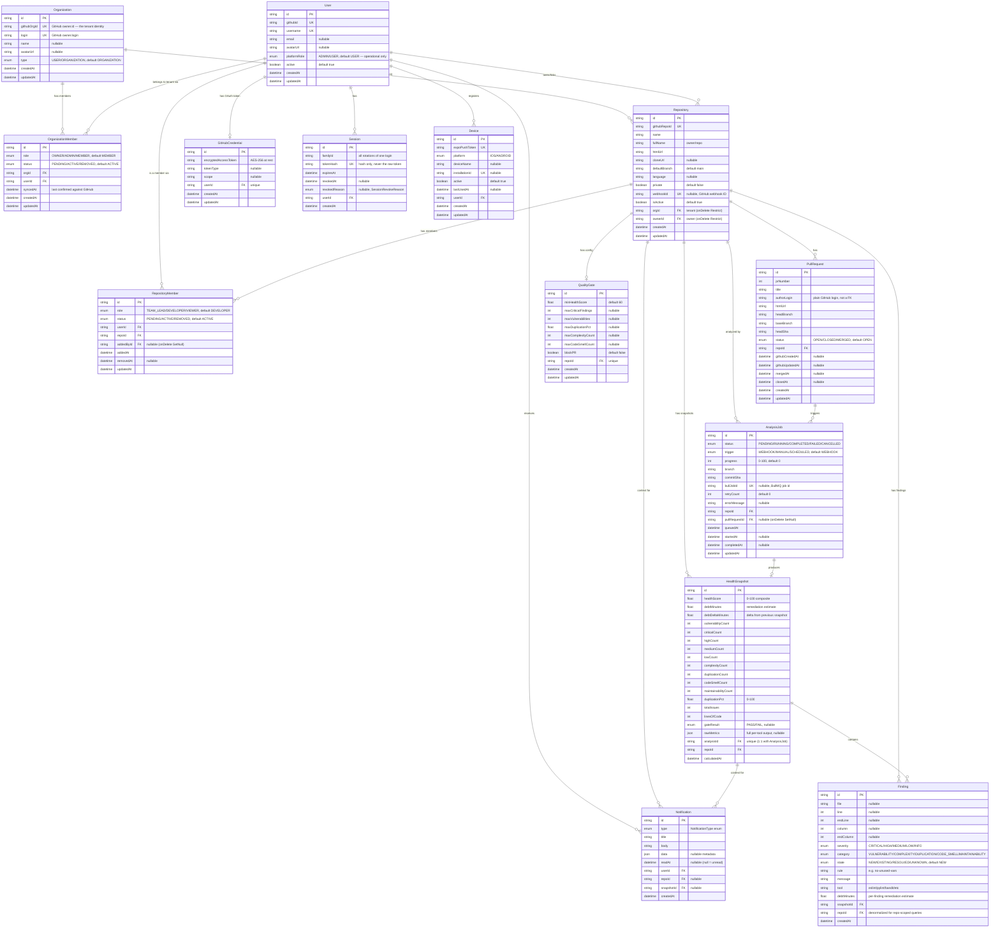

# Database Design Document

> **Project:** Automated Code Review & Technical Debt Tracking Dashboard (PID 4)
> **Module:** CS3023 — University of Moratuwa
> **Date:** 21 June 2026
> **ORM:** Prisma 7.x | **Database:** PostgreSQL 15+

---

## 1. Entity-Relationship Diagram



---

## 2. Prisma Schema

The full schema is in [`packages/db/prisma/schema.prisma`](file:///home/rumeshchathuranga/Documents/SEproject/AutomaticCodereviewandDebtTracking/packages/db/prisma/schema.prisma).

```prisma
// ================================================================
// DATABASE CONFIGURATION
// ================================================================

// Connection URL is configured in prisma.config.ts (Prisma v7+).
datasource db {
  provider = "postgresql"
}

generator client {
  provider = "prisma-client-js"
}

// ================================================================
// ENUMS
// ================================================================

// Platform-level role. This no longer grants access to tenant data —
// it only guards operational endpoints such as the metrics route.
// Organization and repository permissions are handled separately.
enum PlatformRole {
  ADMIN
  USER
}

// Mirrors GitHub's repository owner type. A personal GitHub account is
// modelled as an organization of its own so that personal repositories
// still live inside a tenant.
enum OrgType {
  USER
  ORGANIZATION
}

// Organization-level role, derived from the caller's GitHub org membership.
// OWNER is used for a user's own personal account organization.
enum OrgRole {
  OWNER
  ADMIN
  MEMBER
}

enum RepositoryRole {
  TEAM_LEAD
  DEVELOPER
  VIEWER
}

enum MemberStatus {
  PENDING
  ACTIVE
  REMOVED
}

enum AnalysisStatus {
  PENDING
  RUNNING
  COMPLETED
  FAILED
  CANCELLED
}

enum AnalysisTrigger {
  WEBHOOK
  MANUAL
  SCHEDULED
}

enum Severity {
  CRITICAL
  HIGH
  MEDIUM
  LOW
  INFO
}

enum FindingCategory {
  VULNERABILITY
  COMPLEXITY
  DUPLICATION
  CODE_SMELL
  MAINTAINABILITY
}

enum FindingState {
  NEW
  EXISTING
  RESOLVED
  UNKNOWN
}

enum PRStatus {
  OPEN
  CLOSED
  MERGED
}

enum GateResult {
  PASS
  FAIL
}

enum NotificationType {
  ANALYSIS_STARTED
  ANALYSIS_COMPLETED
  ANALYSIS_FAILED
  QUALITY_GATE_FAILED
  SCORE_DROPPED
  CRITICAL_FINDING
  MEMBER_ADDED
}

enum DevicePlatform {
  IOS
  ANDROID
}

// ================================================================
// USER AND AUTHENTICATION MODELS
// ================================================================

model User {
  id           String       @id @default(cuid())
  githubId     String       @unique
  username     String       @unique
  email        String?
  avatarUrl    String?
  platformRole PlatformRole @default(USER)
  active       Boolean      @default(true)

  // GitHub OAuth credential
  githubCredential GitHubCredential?

  // Authentication sessions
  sessions Session[]

  // Organizations (tenants) this user belongs to
  orgMemberships OrganizationMember[]

  // Repositories directly linked/owned by this user
  ownedRepositories Repository[] @relation("RepositoryOwner")

  // Repository memberships
  memberships RepositoryMember[] @relation("RepositoryMembership")

  // Membership records created by this user
  membersAdded RepositoryMember[] @relation("MembershipAddedBy")

  notifications Notification[]
  devices       Device[]

  createdAt DateTime @default(now())
  updatedAt DateTime @updatedAt

  @@index([platformRole])
  @@index([active])
}

// GitHub OAuth credentials are separated from the normal user profile.
// encryptedAccessToken must be encrypted before it is stored.
model GitHubCredential {
  id                   String  @id @default(cuid())
  encryptedAccessToken String
  tokenType            String?
  scope                String?

  userId String @unique
  user   User   @relation(fields: [userId], references: [id], onDelete: Cascade)

  createdAt DateTime @default(now())
  updatedAt DateTime @updatedAt
}

// One refresh token. Store only its hash, never the original.
// Rotation replaces the row and keeps familyId, so a replayed token can
// take down every token issued from the same login.
model Session {
  id            String               @id @default(cuid())
  familyId      String
  tokenHash     String               @unique
  expiresAt     DateTime
  revokedAt     DateTime?
  revokedReason SessionRevokeReason?

  userId String
  user   User   @relation(fields: [userId], references: [id], onDelete: Cascade)

  createdAt DateTime @default(now())

  @@index([expiresAt])
  @@index([userId, revokedAt])
  @@index([familyId])
}

enum SessionRevokeReason {
  ROTATED
  LOGOUT
  REUSE_DETECTED
  ADMIN_REVOKED
  USER_INACTIVE
}

// ================================================================
// ORGANIZATION (TENANT) MODELS
// ================================================================

// An organization is the tenant boundary. It mirrors a GitHub account
// owner, so both a real GitHub organization and a personal GitHub account
// are represented the same way. Every repository belongs to exactly one.
model Organization {
  id          String  @id @default(cuid())
  githubOrgId String  @unique
  login       String  @unique
  name        String?
  avatarUrl   String?
  type        OrgType @default(ORGANIZATION)

  members      OrganizationMember[]
  repositories Repository[]

  createdAt DateTime @default(now())
  updatedAt DateTime @updatedAt
}

// Which users belong to which tenant. Rows are created and revoked by
// syncing against GitHub, never granted inside this app, so we cannot hand
// out access that GitHub itself would not.
model OrganizationMember {
  id     String       @id @default(cuid())
  role   OrgRole      @default(MEMBER)
  status MemberStatus @default(ACTIVE)

  orgId        String
  organization Organization @relation(fields: [orgId], references: [id], onDelete: Cascade)

  userId String
  user   User   @relation(fields: [userId], references: [id], onDelete: Cascade)

  // Last time GitHub confirmed this membership still exists.
  syncedAt DateTime @default(now())

  createdAt DateTime @default(now())
  updatedAt DateTime @updatedAt

  @@unique([orgId, userId])
  // Every repo-scoped request asks "is this caller in this tenant", so both
  // lookup directions are indexed.
  @@index([userId, status])
  @@index([orgId, status])
}

// ================================================================
// REPOSITORY AND MEMBERSHIP MODELS
// ================================================================

model Repository {
  id            String  @id @default(cuid())
  githubRepoId  String  @unique
  name          String
  fullName      String
  htmlUrl       String
  cloneUrl      String?
  defaultBranch String  @default("main")
  language      String?
  private       Boolean @default(false)

  // Each repository may have at most one registered webhook.
  webhookId String? @unique

  isActive Boolean @default(true)

  // Tenant this repository belongs to. Taken from the GitHub owner of the
  // repo, so it is known even on the webhook path where there is no caller.
  orgId        String
  organization Organization @relation(fields: [orgId], references: [id], onDelete: Restrict)

  // User who linked and controls the repository, within that tenant.
  ownerId String
  owner   User   @relation("RepositoryOwner", fields: [ownerId], references: [id], onDelete: Restrict)

  members       RepositoryMember[]
  pullRequests  PullRequest[]
  analysisJobs  AnalysisJob[]
  snapshots     HealthSnapshot[]
  findings      Finding[]
  qualityGate   QualityGate?
  notifications Notification[]

  createdAt DateTime @default(now())
  updatedAt DateTime @updatedAt

  @@index([fullName])
  @@index([ownerId, isActive])
  @@index([orgId, isActive])
}

// Explicit many-to-many relationship between users and repositories.
// This stores repository-specific roles and membership information.
model RepositoryMember {
  id     String         @id @default(cuid())
  role   RepositoryRole @default(DEVELOPER)
  status MemberStatus   @default(ACTIVE)

  userId String
  user   User   @relation("RepositoryMembership", fields: [userId], references: [id], onDelete: Cascade)

  repoId     String
  repository Repository @relation(fields: [repoId], references: [id], onDelete: Cascade)

  // User who added this member.
  addedById String?
  addedBy   User?   @relation("MembershipAddedBy", fields: [addedById], references: [id], onDelete: SetNull)

  addedAt   DateTime  @default(now())
  removedAt DateTime?
  // Tracks the last time role or status changed for audit purposes.
  updatedAt DateTime  @updatedAt

  @@unique([userId, repoId])
  @@index([repoId, status])
  @@index([addedById])
}

// ================================================================
// PULL REQUEST MODEL
// ================================================================

model PullRequest {
  id          String   @id @default(cuid())
  prNumber    Int
  title       String
  // authorLogin is stored as a plain string because PR authors may not be
  // registered users of this platform. Match against User.username in queries
  // when you need to link a PR to a platform user.
  authorLogin String
  htmlUrl     String
  headBranch  String
  baseBranch  String
  headSha     String
  status      PRStatus @default(OPEN)

  repoId     String
  repository Repository @relation(fields: [repoId], references: [id], onDelete: Cascade)

  analysisJobs AnalysisJob[]

  githubCreatedAt DateTime?
  githubUpdatedAt DateTime?
  mergedAt        DateTime?
  closedAt        DateTime?

  createdAt DateTime @default(now())
  updatedAt DateTime @updatedAt

  @@unique([repoId, prNumber])
  @@index([repoId, status])
  @@index([repoId, updatedAt(sort: Desc)])
}

// ================================================================
// ANALYSIS PROCESSING MODEL
// ================================================================

// Represents the lifecycle of an analysis job:
//
// PENDING -> RUNNING -> COMPLETED
//                    -> FAILED
//
// This model stores queue, worker and execution information.
// NOTE: progress is expected to be in the range 0–100.
// Enforcement of this range is the responsibility of the service layer.
model AnalysisJob {
  id       String          @id @default(cuid())
  status   AnalysisStatus  @default(PENDING)
  trigger  AnalysisTrigger @default(WEBHOOK)
  progress Int             @default(0)

  branch    String
  commitSha String

  // BullMQ or other queue job identifier.
  bullJobId String? @unique

  retryCount   Int     @default(0)
  errorMessage String?

  repoId     String
  repository Repository @relation(fields: [repoId], references: [id], onDelete: Cascade)

  // Optional because manual repository analyses may not belong to a PR.
  pullRequestId String?
  pullRequest   PullRequest? @relation(fields: [pullRequestId], references: [id], onDelete: SetNull)

  // An analysis produces zero or one final snapshot.
  snapshot HealthSnapshot?

  queuedAt    DateTime  @default(now())
  startedAt   DateTime?
  completedAt DateTime?
  updatedAt   DateTime  @updatedAt

  @@index([repoId, status])
  @@index([status, queuedAt])
  @@index([pullRequestId])
  @@index([repoId, queuedAt(sort: Desc)])
}

// ================================================================
// HEALTH SNAPSHOT MODEL
// ================================================================

// Stores the final calculated result produced by an analysis job.
// Multiple snapshots are retained for historical trend analysis.
model HealthSnapshot {
  id String @id @default(cuid())

  // Composite repository score from 0 to 100.
  healthScore Float

  // Technical debt totals.
  // debtMinutes      — absolute accumulated debt in minutes for this snapshot.
  // debtDeltaMinutes — change in debt relative to the immediately preceding
  //                    snapshot for this repository (negative = improvement).
  debtMinutes      Float @default(0)
  debtDeltaMinutes Float @default(0)

  // Finding counts.
  vulnerabilityCount Int @default(0)
  criticalCount      Int @default(0)
  highCount          Int @default(0)
  mediumCount        Int @default(0)
  lowCount           Int @default(0)

  complexityCount      Int @default(0)
  duplicationCount     Int @default(0)
  codeSmellCount       Int @default(0)
  maintainabilityCount Int @default(0)

  duplicationPct Float @default(0)

  totalIssues Int @default(0)
  linesOfCode Int @default(0)

  // Quality gate result for this snapshot.
  // NOTE: maxCriticalFindings and maxVulnerabilities in QualityGate are
  // evaluated independently — a finding can be both CRITICAL severity and
  // VULNERABILITY category, and will count toward both thresholds.
  gateResult GateResult?

  // Full output from analysis tools.
  // This should not normally be returned to the mobile application.
  rawMetrics Json?

  // One-to-one relationship with the analysis job.
  analysisId String      @unique
  analysis   AnalysisJob @relation(fields: [analysisId], references: [id], onDelete: Cascade)

  // Direct repository relationship supports faster trend queries.
  repoId     String
  repository Repository @relation(fields: [repoId], references: [id], onDelete: Cascade)

  findings      Finding[]
  notifications Notification[]

  calculatedAt DateTime @default(now())

  @@index([repoId, calculatedAt(sort: Desc)])
  @@index([calculatedAt(sort: Desc)])
}

// ================================================================
// FINDING MODEL
// ================================================================

// Represents one issue detected by a static-analysis tool.
model Finding {
  id String @id @default(cuid())

  file      String?
  line      Int?
  endLine   Int?
  column    Int?
  endColumn Int?

  severity Severity
  category FindingCategory
  // Defaults to NEW because a finding is always freshly detected at creation.
  state    FindingState    @default(NEW)

  rule    String
  message String
  tool    String

  debtMinutes Float @default(5)

  snapshotId String
  snapshot   HealthSnapshot @relation(fields: [snapshotId], references: [id], onDelete: Cascade)

  // Direct repository link for efficient repo-scoped dashboard queries
  // without joining through HealthSnapshot.
  repoId     String
  repository Repository @relation(fields: [repoId], references: [id], onDelete: Cascade)

  createdAt DateTime @default(now())

  @@index([snapshotId, category])
  @@index([snapshotId, severity])
  @@index([snapshotId, state])
  @@index([snapshotId, file])
  @@index([repoId, severity])
  @@index([repoId, state])
}

// ================================================================
// QUALITY GATE MODEL
// ================================================================

// Each repository may have one quality-gate configuration.
// maxCriticalFindings — cap on findings with Severity.CRITICAL (any category).
// maxVulnerabilities  — cap on findings with FindingCategory.VULNERABILITY (any severity).
// These two thresholds are evaluated independently.
model QualityGate {
  id String @id @default(cuid())

  minHealthScore      Float  @default(60)
  maxCriticalFindings Int?
  maxVulnerabilities  Int?
  maxDuplicationPct   Float?
  maxComplexityCount  Int?
  maxCodeSmellCount   Int?

  // Determines whether a failed gate should block the PR.
  blockPR Boolean @default(false)

  repoId     String     @unique
  repository Repository @relation(fields: [repoId], references: [id], onDelete: Cascade)

  createdAt DateTime @default(now())
  updatedAt DateTime @updatedAt
}

// ================================================================
// NOTIFICATION MODEL
// ================================================================

// The `data` field carries a type-specific JSON payload.
// Expected shapes per NotificationType are enforced in the service layer
// via Zod schemas — see src/notifications/schemas.ts.
model Notification {
  id    String           @id @default(cuid())
  type  NotificationType
  title String
  body  String
  data  Json?

  readAt DateTime?

  userId String
  user   User   @relation(fields: [userId], references: [id], onDelete: Cascade)

  // Repository may be deleted while notification history remains.
  repoId     String?
  repository Repository? @relation(fields: [repoId], references: [id], onDelete: SetNull)

  // Snapshot may also be removed while notification history remains.
  snapshotId String?
  snapshot   HealthSnapshot? @relation(fields: [snapshotId], references: [id], onDelete: SetNull)

  createdAt DateTime @default(now())

  @@index([repoId])
  @@index([snapshotId])
  @@index([userId, createdAt(sort: Desc)])
  @@index([userId, readAt, createdAt(sort: Desc)])
}

// ================================================================
// MOBILE DEVICE MODEL
// ================================================================

// Stores Expo push-notification tokens for users' mobile devices.
model Device {
  id             String         @id @default(cuid())
  expoPushToken  String         @unique
  platform       DevicePlatform
  deviceName     String?
  // Unique identifier for a specific app installation on a device.
  // Used to prevent duplicate device registrations.
  installationId String?        @unique
  active         Boolean        @default(true)
  lastUsedAt     DateTime?

  userId String
  user   User   @relation(fields: [userId], references: [id], onDelete: Cascade)

  createdAt DateTime @default(now())
  updatedAt DateTime @updatedAt

  @@index([userId, active])
}
```

---

## 3. Design Rationale

### 3.1 Why `Finding` is a Separate Table (not JSON on Snapshot)

| Approach | Pros | Cons |
|---|---|---|
| JSON column on `HealthSnapshot` | Simpler write (one INSERT) | Cannot query individual findings efficiently; no filtering by severity/category/file without parsing JSON; no aggregation (e.g. "top files by finding count") |
| Separate `Finding` table | Full SQL queryability; can index by severity, category, file; supports dashboard features like file-level hotspot heatmaps, severity distribution charts, and per-rule trending | More rows; slightly more complex write (batch INSERT) |

**Decision:** Separate table. The dashboard's value proposition depends on slicing findings by file, severity, and category. A JSON blob would make these queries either impossible or require application-level filtering, which breaks down at scale and prevents PostgreSQL's query optimizer from helping.

The `rawMetrics` JSON column on `HealthSnapshot` stores the *full unprocessed tool output* as a debugging/audit trail — it is never queried by the application, only displayed verbatim when a developer wants the raw data.

### 3.2 How `Finding.state` is Determined

Each finding stores a `state` (`FindingState` enum) instead of a plain boolean, so the
dashboard can distinguish freshly introduced, carried-over, resolved, and
baseline-less findings. When the worker analyzes a PR:

1. It analyzes the **PR head branch** (the proposed code).
2. It compares findings against the **most recent completed snapshot on the same repository's default branch** (i.e., the last merge to `main`).
3. `state = NEW` if the same `(file, rule)` tuple does **not** exist in the baseline (or the file is entirely new in the PR).
4. `state = EXISTING` if the same `(file, rule)` exists in the baseline (line numbers may shift slightly; we match on file+rule with a configurable line-proximity tolerance of ±5 lines).
5. `state = RESOLVED` is reserved for baseline findings that are absent in the head — this powers the "issues fixed by this PR" count (`resolvedIssues` in `api_design.md`).
6. `state = UNKNOWN` when there is no baseline to compare against (the repository's first analysis).

This lets the PR comment say "3 new issues introduced, 12 pre-existing" — the developer only needs to fix what they broke. The API surfaces a derived `isNew` boolean (`state == NEW`) for convenience.

### 3.3 How `debtDeltaMinutes` is Calculated

```
debtDeltaMinutes = current_snapshot.debtMinutes - previous_snapshot.debtMinutes
```

Where `previous_snapshot` is the most recent snapshot for the **same repository** (by
`calculatedAt` order). Because a `HealthSnapshot` is only ever written once its
`AnalysisJob` completes, every existing snapshot is already a completed result — there
is no `status` column to filter on here (status lives on `AnalysisJob`). The query:

```sql
SELECT "debtMinutes" FROM "HealthSnapshot"
WHERE "repoId" = $1 AND "id" != $2
ORDER BY "calculatedAt" DESC
LIMIT 1
```

- **Positive debtDeltaMinutes**: technical debt increased (bad)
- **Negative debtDeltaMinutes**: technical debt decreased (good)
- **Zero or first snapshot**: debtDeltaMinutes = 0

This is calculated at the end of the worker's SCORE stage and persisted on the snapshot row.

### 3.4 Why `PullRequest` is a Separate Entity

Rather than just storing `prNumber` on the snapshot, we track PRs as first-class entities because:

- The dashboard needs to show PR lists with metadata (title, author, branch, status)
- A single PR can have **multiple snapshots** (re-analyzed on each push to the PR branch)
- PR status tracking (open/closed/merged) enables filtering in the UI

The compound unique constraint `@@unique([repoId, prNumber])` prevents duplicates when multiple webhook events arrive for the same PR.

### 3.5 How `HealthSnapshot` Relates to PRs and Repositories

The PR association lives on `AnalysisJob`, not on the snapshot:

- `AnalysisJob.pullRequestId` is **nullable** — manual/scheduled analyses target a repo, not a PR.
- `HealthSnapshot.analysisId` is a **unique** 1:1 link to the job that produced it, so the PR (if any) is reachable via `snapshot → analysis → pullRequest`.
- `HealthSnapshot.repoId` is a **denormalized, always-set** column — it enables trend queries across ALL analyses for a repo (both PR-triggered and manual) without joining through `AnalysisJob`/`PullRequest`.
- The `@@index([repoId, calculatedAt(sort: Desc)])` index powers the trend chart directly.

### 3.6 `debtMinutes` Per-Finding Estimation

Each finding carries a `debtMinutes` field estimating remediation effort. Default values by severity:

| Severity | Default debtMinutes |
|---|---|
| CRITICAL | 30 |
| HIGH | 20 |
| MEDIUM | 10 |
| LOW | 5 |
| INFO | 2 |

The snapshot's `debtMinutes` is the **sum** of all its findings' `debtMinutes`. This gives a "remediation effort in minutes" metric that non-technical project managers can understand.

### 3.7 Roles: Organization-Level, Repository-Level, Platform-Level

Roles are split across **three axes** rather than a single global role. The organization is
the tenant boundary; the repository relationship decides what you may do inside it; and the
platform role has no say over tenant data at all.

**Organization role** (`OrganizationMember.role`, enum `OrgRole`) — *which tenant you are in*:

| Org role | Meaning |
|---|---|
| `OWNER` | A user's own personal account organization, and GitHub org owners. Full control of the tenant's repos. |
| `ADMIN` | Mapped from a GitHub org role of `admin`. Same repo control as `OWNER`. |
| `MEMBER` | Mapped from any other GitHub org role. In the tenant, but still needs a repository grant to open a specific repo. |

**Repository relationship** (per repo, within a tenant):

| Relationship | Source | Can do |
|---|---|---|
| Owner | `Repository.ownerId` | Full control: unlink, configure quality gate, trigger manual analysis, manage members. |
| Member | `RepositoryMember` row with a `RepositoryRole` (`TEAM_LEAD` / `DEVELOPER` / `VIEWER`) and `MemberStatus` | `TEAM_LEAD`: manage the repo alongside the owner. `DEVELOPER`: read + manage own notifications/devices. `VIEWER`: read-only. |

**Platform role** (`User.platformRole`, enum `PlatformRole`):

| Platform role | Meaning |
|---|---|
| `ADMIN` | Operational only — `GET /api/metrics` and the queue dashboard. **Grants no access to any tenant's data.** |
| `USER` | Everyone else. The default on signup. |

**Why ownership is a column and membership is a join table:** `Repository.ownerId` identifies the single user who linked the repo and holds ultimate control; `RepositoryMember` is a many-to-many table so the owner (or a `TEAM_LEAD` member) can grant scoped access to multiple users, and a user can be a member of many repos. The owner does **not** need a `RepositoryMember` row — ownership already implies full access, and duplicating it would create two sources of truth. `MemberStatus` (`PENDING`/`ACTIVE`/`REMOVED`) plus `removedAt` supports soft-removal and audit without deleting history.

**Why the platform admin lost its bypass:** an `ADMIN` that can read every tenant is not
tenant isolation — it is a documented hole in it. The requirement is that a user can never
reach another organization's data, and an exception for our own operator accounts would
make that claim untrue. `platformRole` therefore survives only to guard platform-wide
*operational* routes, which expose counts and queue state rather than anyone's code.

Authorization check for "can this user read this repo" — see §3.12 for the tenant clause
that now precedes the repository clause.

**Bootstrap:** `platformRole` defaults to `USER` on signup. The first `ADMIN` for a deployment is set directly in the database (there is no self-service admin signup). Linking a repository makes the user that repo's **owner** (`ownerId`) inside the organization the repo belongs to on GitHub.

> **Forward-looking:** `RepositoryRole.VIEWER` and `MemberStatus.PENDING` are defined for future use (a read-only tier and an invite flow) and are not yet exercised by any MVP endpoint.

### 3.8 Why `Device` is Keyed to `User`, Not `Repository`

Push tokens belong to a physical device the user is signed in on, not to any single repository — the same device should receive notifications across every repo the user has access to. `Device.userId` cascades on delete so removing a user cleans up their registered devices automatically. `expoPushToken` is globally unique because Expo issues one token per device+app installation; a `409 Conflict` on duplicate registration (see `api_design.md` §8) reuses the existing row instead of creating a second one. `installationId` is a second unique key that lets the client re-register the same install idempotently.

### 3.9 Why `AnalysisJob` is Separate from `HealthSnapshot`

The processing lifecycle and the result are two different concerns, so they are two tables:

- `AnalysisJob` holds **mutable execution state** — `status` (`PENDING`→`RUNNING`→`COMPLETED`/`FAILED`/`CANCELLED`), `progress`, `retryCount`, `errorMessage`, `bullJobId`, and the queue/worker timestamps. It exists the moment work is enqueued.
- `HealthSnapshot` holds the **immutable computed result** — score, counts, debt — and is written exactly once, when the job completes successfully (`analysisId` is a unique 1:1 link back to the job).

This keeps trend/history queries on `HealthSnapshot` free of half-finished or failed rows, and lets the API report job progress (`GET /api/repos/:repoId/analyze` returns an `analysisId`, since a snapshot does not exist yet at enqueue time).

### 3.10 Why GitHub Credentials Live in a Separate Table

`GitHubCredential` holds the `encryptedAccessToken` (AES-256 at rest) in its own table with a 1:1 link to `User`, rather than as a column on `User`. This keeps the sensitive secret out of the common user profile that is read on nearly every request, narrows the surface that ever loads the token, and lets the credential be revoked/rotated (deleted) independently of the user account.

### 3.11 Why Sessions Store Only a Token Hash

`Session.tokenHash` stores a SHA-256 hash of the refresh token, never the raw token. If the database is ever exposed, stored hashes cannot be replayed as valid sessions. `revokedAt` supports explicit logout/invalidation, and `@@index([expiresAt])` supports the cleanup that prunes expired sessions.

SHA-256 rather than bcrypt: the token is 256 bits of CSPRNG output, so there is no guessable-password threat to slow down, and a plain hash keeps the lookup on the unique index.

**One row per token, not per login.** Each refresh rotates: the presented row is marked `revokedAt` / `revokedReason = ROTATED` and a successor is inserted carrying the same `familyId`. `expiresAt` is copied to the successor rather than extended, so a family dies a fixed 7 days after login however active the user is.

`familyId` is what makes reuse detection cheap. If an already-spent token is presented again, a copy of it exists somewhere, and one indexed `updateMany` on `familyId` revokes every live token from that login. `revokedReason` is load-bearing rather than decorative — the 10-second grace window that stops two browser tabs from falsely tripping detection has to tell `ROTATED` apart from `LOGOUT`.

Deliberately **not** stored: `rotatedAt` (redundant with `revokedAt`), `lastUsedAt` (under strict rotation every row is presented exactly once), `replacedById` (walking a chain instead of one family query), and `userAgent` / `ip` (nothing consumes them yet).

There is no scheduler process, so `createSession` fires `pruneExpiredSessions()` opportunistically after each login — logins are rare enough for that to be free and frequent enough to keep the table bounded.

### 3.12 Organization-Level Multi-Tenancy

Multiple organizations share one deployment, and a user must never be able to reach data
belonging to an organization they are not in. Four decisions make that work.

**An organization mirrors a GitHub account owner, not just a GitHub org.** Every repository
on GitHub has an `owner` object — `{ id, login, type: "User" | "Organization" }` — and GitHub
treats personal accounts and organizations the same way there. `Organization` copies that
object, with `OrgType` recording which kind it is. Two things fall out of this for free: a
personal repository needs no special case, because the user's own account is simply their own
organization; and `Repository.orgId` can be derived from the payload GitHub sends us, so the
webhook path knows the tenant even though there is no signed-in user on it.

**Membership is derived from GitHub, never granted here.** `OrganizationMember` rows are
written by syncing `GET /user/memberships/orgs` (requires the `read:org` scope), mapping the
GitHub org role `admin` to `ADMIN` and anything else to `MEMBER`. Nothing in this application
can create a membership on its own, so we cannot hand out access GitHub itself would not.
The sync also runs in reverse: any `ACTIVE` membership GitHub stops reporting is set to
`REMOVED`, which is what makes removal from a GitHub org actually revoke access here.
`syncedAt` records when that was last confirmed.

**The tenant anchor is `Repository.orgId`, and only that.** `orgId` is deliberately *not*
denormalized onto `HealthSnapshot`, `Finding`, `AnalysisJob` or `PullRequest`, even though
those tables already denormalize `repoId`. One anchor means one place where isolation can be
right or wrong; a second copy could drift out of sync with its repository and silently become
a leak. Every child row reaches its tenant through `repoId`, which it already carries. If
Postgres row-level security is ever wanted, an `orgId` column can be added then — but it is
not needed to enforce the boundary in application code today.

**Cross-tenant denials return `404`, not `403`.** A `403` on a repository or organization that
belongs to someone else confirms that it exists, and its existence is itself that tenant's
information. So the guard reports the resource as missing. A `403` is still returned once the
caller is *inside* the right tenant but lacks the specific repository grant, because at that
point they are entitled to know the repository is there.

**Membership is checked on every request, and is not carried in the token.** The app JWT holds
only `sub`, `username` and `platformRole`; it holds no `orgId` and no membership list. Had it
carried them, a user removed from an organization would keep access until their token expired
— up to seven days by default. Instead each repo-scoped request reads `OrganizationMember`
directly, so revocation takes effect on the very next request. The cost is one indexed lookup,
covered by `@@index([userId, status])`, and it is folded into the query the guard already runs
to load the repository (see Query 6).

---

## 4. Critical Query Support Analysis

### Query 1: Health Score Trend for Repo X Over Last 30 Days

```sql
SELECT "healthScore", "calculatedAt", "debtMinutes", "totalIssues"
FROM "HealthSnapshot"
WHERE "repoId" = $1
  AND "calculatedAt" >= NOW() - INTERVAL '30 days'
ORDER BY "calculatedAt" ASC;
```

Every `HealthSnapshot` is already a completed result (it is written only when its `AnalysisJob` finishes), so no `status` filter is needed here.

**Index used:** `@@index([repoId, calculatedAt(sort: Desc)])` — covers both the WHERE filter on `repoId` and the ORDER BY on `calculatedAt`.

**Verified (C-05, measured with `EXPLAIN ANALYZE`):** ✅ against a repo seeded with 200 snapshots (one per day for ~200 days), the planner used a Bitmap Index Scan on `HealthSnapshot_repoId_calculatedAt_idx` to find the 29 rows inside the 30-day window, then sorted them — 0.79ms buffer scan, 2.07ms total including planning. No Seq Scan at any row count tested.

```
Sort  (cost=31.27..31.35 rows=31 width=28) (actual time=1.459..1.460 rows=29 loops=1)
  ->  Bitmap Heap Scan on "HealthSnapshot"  (actual time=0.787..0.791 rows=29 loops=1)
        Recheck Cond: (("repoId" = $1) AND ("calculatedAt" >= now() - '30 days'::interval))
        ->  Bitmap Index Scan on "HealthSnapshot_repoId_calculatedAt_idx"
              Index Cond: (("repoId" = $1) AND ("calculatedAt" >= now() - '30 days'::interval))
Execution Time: 2.069 ms
```

---

### Query 2: Top 5 Files by Finding Count (for a Repository)

```sql
SELECT f."file", COUNT(*) as finding_count,
       SUM(CASE WHEN f."state" = 'NEW' THEN 1 ELSE 0 END) as new_count
FROM "Finding" f
JOIN "HealthSnapshot" hs ON f."snapshotId" = hs."id"
WHERE hs."repoId" = $1
  AND hs."id" = $2  -- latest snapshot
GROUP BY f."file"
ORDER BY finding_count DESC
LIMIT 5;
```

**Indexes used:**
- `@@index([snapshotId, file])` on Finding — groups findings by file within a snapshot
- `@@index([repoId, calculatedAt(sort: Desc)])` on HealthSnapshot — to find the latest snapshot

**Verified (C-05, measured with `EXPLAIN ANALYZE`):** ✅ against a snapshot with 4 findings, the planner used `HealthSnapshot_pkey` for the `hs.id = $2` lookup and a Bitmap Index Scan on `Finding_snapshotId_file_idx` for the join — 1.3ms total. Note the `hs."repoId" = $1` predicate here is applied as a post-scan **Filter**, not an index condition, because `hs."id" = $2` (the primary key) is already selective enough on its own; this is expected and correct.

```
->  Nested Loop  (actual time=0.084..0.087 rows=4 loops=1)
      ->  Index Scan using "HealthSnapshot_pkey" on "HealthSnapshot" hs
            Index Cond: (id = $2)
            Filter: ("repoId" = $1)
      ->  Bitmap Heap Scan on "Finding" f
            Recheck Cond: ("snapshotId" = $2)
            ->  Bitmap Index Scan on "Finding_snapshotId_file_idx"
                  Index Cond: ("snapshotId" = $2)
Execution Time: 1.325 ms
```

---

### Query 3: New vs Carried-Over Findings for a PR Snapshot

```sql
SELECT "state", "severity", COUNT(*) as count
FROM "Finding"
WHERE "snapshotId" = $1
GROUP BY "state", "severity"
ORDER BY "state", "severity";
```

**Index used:** `@@index([snapshotId, state])` — directly supports filtering and grouping by state within a snapshot.

**Verified (C-05, measured with `EXPLAIN ANALYZE`):** ✅ 0.045ms execution. One caveat found during validation: the planner actually satisfied the `WHERE "snapshotId" = $1` filter via a Bitmap Index Scan on `Finding_snapshotId_file_idx`, not `Finding_snapshotId_state_idx` — both share `snapshotId` as their leading column, so either works for a plain equality filter, and Postgres picked whichever it happened to consider first. The `state`/`severity`/`category` grouping itself is done in memory (`GroupAggregate`) regardless of which index answered the `snapshotId` lookup, so this query doesn't exercise `[snapshotId, state]`'s second column at all — that index earns its keep on queries that also *filter* by state (e.g. "only NEW findings"), not this unfiltered breakdown.

```
GroupAggregate  (actual time=0.029..0.031 rows=4 loops=1)
  Group Key: state, severity
  ->  Bitmap Heap Scan on "Finding"  (actual time=0.015..0.015 rows=4 loops=1)
        Recheck Cond: ("snapshotId" = $1)
        ->  Bitmap Index Scan on "Finding_snapshotId_file_idx"
              Index Cond: ("snapshotId" = $1)
Execution Time: 0.045 ms
```

---

### Query 4: User's Unread Notifications (Most Recent First)

```sql
SELECT *
FROM "Notification"
WHERE "userId" = $1
  AND "readAt" IS NULL
ORDER BY "createdAt" DESC
LIMIT 20;
```

**Index used:** `@@index([userId, readAt, createdAt(sort: Desc)])` — covers all three columns in the WHERE + ORDER BY. PostgreSQL can satisfy this entirely from the index.

**Verified:** ✅ Efficient. The three-column composite index is designed exactly for this query pattern.

---

### Query 5: Quality Gate Evaluation (Does This Snapshot Pass?)

```sql
SELECT qg.*
FROM "QualityGate" qg
WHERE qg."repoId" = $1;

-- Then in application code:
-- pass = snapshot.healthScore >= gate.minHealthScore
--   AND (gate.maxCriticalFindings IS NULL OR snapshot.criticalCount <= gate.maxCriticalFindings)
--   AND (gate.maxVulnerabilities IS NULL OR snapshot.vulnerabilityCount <= gate.maxVulnerabilities)
--   AND (gate.maxDuplicationPct IS NULL OR snapshot.duplicationPct <= gate.maxDuplicationPct)
--   AND (gate.maxComplexityCount IS NULL OR snapshot.complexityCount <= gate.maxComplexityCount)
--   AND (gate.maxCodeSmellCount IS NULL OR snapshot.codeSmellCount <= gate.maxCodeSmellCount)
```

**Index used:** `QualityGate.repoId` has a `@unique` constraint, which PostgreSQL implements as a unique B-tree index. Single-row lookup by primary key equivalent.

**Verified:** ✅ O(1) lookup. The comparison logic is trivial application-side arithmetic on a single row.

---

### Query 6: Can This User Access This Repository? (Authorization Check)

Two layers, resolved in one round trip. The tenant clause comes first: if it fails the answer
is "no such repository", regardless of anything else.

```sql
SELECT
  r."id", r."orgId", r."ownerId", r."isActive",
  om."role"   AS "orgRole",   om."status" AS "orgStatus",     -- layer 1: tenant
  rm."role"   AS "repoRole",  rm."status" AS "repoStatus"     -- layer 2: repo grant
FROM "Repository" r
LEFT JOIN "OrganizationMember" om
  ON om."orgId" = r."orgId" AND om."userId" = $2
LEFT JOIN "RepositoryMember" rm
  ON rm."repoId" = r."id"   AND rm."userId" = $2
WHERE r."id" = $1;
```

The decision is then made in application code from that single row:

1. no row, or `isActive = false` → **404**
2. `orgStatus <> 'ACTIVE'` → **404** — the caller is outside the tenant, so the repository is
   reported as missing rather than forbidden (see §3.12)
3. caller is `ownerId`, or `orgRole` is `OWNER`/`ADMIN` → allow
4. otherwise `repoStatus = 'ACTIVE'` for a read; additionally `repoRole = 'TEAM_LEAD'` for a write
5. otherwise → **403** — inside the tenant, but without a grant on this repository

There is deliberately no `platformRole` branch. Tenant isolation has no operator exception.

**Indexes used:** `Repository` primary key; `@@unique([orgId, userId])` on `OrganizationMember`;
`@@unique([userId, repoId])` on `RepositoryMember`. All three are unique B-trees, so each join
is a single-row point lookup.

**Verified:** ✅ O(1). This runs on every protected repo-scoped request — adding the tenant
check costs one extra index lookup in the same query, not an extra round trip.

---

### Query 7: Repo List for a User (`GET /api/repos`)

This query wasn't in the original Critical Query list because the route (`GET /api/repos`, `api_design.md` §"List repositories") isn't implemented yet. Constructed here from that endpoint's documented contract — owner-or-active-member visibility, sortable by `healthScore`/`name`/`updatedAt`, paginated, each row carrying its latest snapshot score and open-PR count — so C-05 (index validation) has something concrete to check it against. **Whoever implements the route should treat this as a starting point, not a finished spec — it hasn't been reviewed against the real handler code.**

```sql
SELECT
  r.id, r.name, r."fullName", r.language, r."isActive", r."defaultBranch",
  latest."healthScore" AS "latestScore",
  latest."debtDeltaMinutes",
  latest."calculatedAt" AS "lastAnalyzedAt",
  (SELECT COUNT(*)::int FROM "PullRequest" pr WHERE pr."repoId" = r.id AND pr."status" = 'OPEN') AS "totalOpenPRs"
FROM "Repository" r
LEFT JOIN LATERAL (
  SELECT hs."healthScore", hs."debtDeltaMinutes", hs."calculatedAt"
  FROM "HealthSnapshot" hs
  WHERE hs."repoId" = r.id
  ORDER BY hs."calculatedAt" DESC
  LIMIT 1
) latest ON true
WHERE EXISTS (
       SELECT 1 FROM "OrganizationMember" om
       WHERE om."orgId" = r."orgId" AND om."userId" = $1 AND om."status" = 'ACTIVE'
     )
  AND (
       r."ownerId" = $1
    OR EXISTS (
         SELECT 1 FROM "RepositoryMember" rm
         WHERE rm."repoId" = r.id AND rm."userId" = $1 AND rm."status" = 'ACTIVE'
       )
     )
ORDER BY latest."healthScore" DESC NULLS LAST
LIMIT 20 OFFSET 0;
```

The tenant clause is `AND`-ed, not `OR`-ed, with the repository clause — it is a filter every
row must pass, not another way to qualify. Getting that wrong would turn the boundary into a
second route in.

**Indexes used:**
- `@@index([repoId, calculatedAt(sort: Desc)])` on `HealthSnapshot` — the `LATERAL` join for each repo's latest snapshot.
- `@@unique([userId, repoId])` on `RepositoryMember` — the membership `EXISTS` check.
- `@@index([repoId, status])` on `PullRequest` — the open-PR count subquery.

**Verified (C-05, measured with `EXPLAIN ANALYZE`, 2,005-row `Repository` table — 5 real repos + 2,000 seeded "noise" repos owned by other users):** ✅ fast (0.99ms total) but with a genuine finding, not a clean pass:

```
Limit  (actual time=0.906..0.927 rows=5 loops=1)
  ->  Sort  (actual time=0.884..0.886 rows=5 loops=1)
        Sort Key: hs."healthScore" DESC NULLS LAST
        ->  Nested Loop Left Join  (actual time=0.061..0.866 rows=5 loops=1)
              ->  Seq Scan on "Repository" r  (actual time=0.038..0.761 rows=5 loops=1)
                    Filter: (("ownerId" = $1) OR (ANY (id = (hashed SubPlan).col1)))
                    Rows Removed by Filter: 2000
              ->  Limit  (actual time=0.020..0.020 rows=1 loops=5)
                    ->  Index Scan using "HealthSnapshot_repoId_calculatedAt_idx" on "HealthSnapshot" hs
                          Index Cond: ("repoId" = r.id)
Execution Time: 0.993 ms
```

The `LATERAL` join (latest snapshot) and the open-PR subquery both use their expected indexes. But the top-level `Repository` scan is a **Seq Scan**, not an index scan on `[ownerId, isActive]`, even though the `ownerId = $1` branch alone is indexed. This is the planner behaving correctly, not a missing index: the `OR EXISTS(...)` makes the whole predicate a combination of a plain equality and a hashed semi-join, which Postgres can't turn into a single index condition, and at ~2,000 rows (54 buffer pages) a full sequential scan is cheaper than the alternative of two index scans plus a `BitmapOr`. Sub-millisecond either way at this scale — a platform would need a much larger linked-repo count before this predicate's plan choice would matter. Left as-is; revisit only if `Repository` grows into the tens of thousands of rows and this query shows up slow in practice.

---

### Index Summary Table

| Table | Index | Supports |
|---|---|---|
| `Organization` | `githubOrgId` (unique) | Upsert a tenant during GitHub org sync |
| `Organization` | `login` (unique) | Tenant lookup by GitHub login |
| `OrganizationMember` | `[orgId, userId]` (unique) | **Tenant access check on every repo-scoped request** |
| `OrganizationMember` | `[userId, status]` | "Which tenants can this caller see" — `GET /api/orgs` |
| `OrganizationMember` | `[orgId, status]` | Active member list for a tenant |
| `Repository` | `[orgId, isActive]` | Repo list scoped to one tenant |
| `AnalysisJob` | `[status, queuedAt]` | Worker: poll oldest pending jobs |
| `AnalysisJob` | `[repoId, status]` | In-flight jobs per repo (429 guard) |
| `AnalysisJob` | `[repoId, queuedAt DESC]` | Job history per repo |
| `AnalysisJob` | `[pullRequestId]` | Jobs for a PR; FK lookup |
| `HealthSnapshot` | `[repoId, calculatedAt DESC]` | Trend charts, latest snapshot, debt-delta calc |
| `HealthSnapshot` | `[calculatedAt DESC]` | Global recent analyses |
| `Finding` | `[snapshotId, category]` | Category-filtered finding views |
| `Finding` | `[snapshotId, severity]` | Severity-filtered finding views |
| `Finding` | `[snapshotId, state]` | New/existing/resolved split |
| `Finding` | `[snapshotId, file]` | File hotspot analysis |
| `Finding` | `[repoId, severity]` / `[repoId, state]` | Repo-scoped finding rollups |
| `Notification` | `[userId, readAt, createdAt DESC]` | Unread notifications feed |
| `Notification` | `[userId, createdAt DESC]` | All notifications feed |
| `Notification` | `[repoId]` / `[snapshotId]` | `SetNull` FK cleanup on repo/snapshot delete |
| `PullRequest` | `[repoId, prNumber]` (unique) | Upsert on webhook; also serves `repoId` lookups (leftmost prefix) |
| `PullRequest` | `[repoId, status]` | PR list filtered by status (and plain `repoId`) |
| `PullRequest` | `[repoId, updatedAt DESC]` | PR list ordered by recency |
| `RepositoryMember` | `[userId, repoId]` (unique) | Repo access check; also serves `userId` lookups (leftmost prefix) |
| `RepositoryMember` | `[repoId, status]` | Active-member list for a repo (and plain `repoId`) |
| `Device` | `[userId, active]` | Active devices to push-notify (and plain `userId`) |

> **Note on intentionally omitted indexes:** we deliberately do **not** define a single-column index when it would be a **leftmost-prefix duplicate** of an existing composite or `@unique` index — Postgres already answers those lookups from the wider index's leading column, so a second index would only add write and storage overhead. Concretely, the following are intentionally absent: `User.[username]` (covered by `@unique`), `Session.[userId]` (covered by `[userId, revokedAt]`), `Repository.[ownerId]` (`[ownerId, isActive]`), `RepositoryMember.[userId]`/`[repoId]` (unique `[userId, repoId]` and `[repoId, status]`), `PullRequest.[repoId]` (`[repoId, status]` / unique `[repoId, prNumber]`), `AnalysisJob.[repoId]`/`[status]` (`[repoId, status]` and `[status, queuedAt]`), `HealthSnapshot.[repoId]` (`[repoId, calculatedAt]`), `Finding.[snapshotId]` (`[snapshotId, …]`), `Notification.[userId]`/`[userId, readAt]` (`[userId, readAt, createdAt]`), and `Device.[userId]` (`[userId, active]`). We also avoid low-cardinality/unused single-column indexes that no documented query needs (e.g. `Repository.[isActive]`, `PullRequest.[status]`, `Finding.[severity]`/`[category]`, `HealthSnapshot.[gateResult]`). The snapshot timestamp is `calculatedAt`; there is no separate `createdAt` (it would be identical).

---

*This schema is implemented in `packages/db/prisma/schema.prisma` and captured in two migrations: the baseline `20260719051244_init`, and `20260731035716_add_organization_tenancy` which introduces the tenant boundary. Apply them with `npx prisma migrate dev` (or `migrate deploy` in CI) against a running PostgreSQL instance.*

*The tenancy migration is the one hand-edited migration in the project. `Repository.orgId` is `NOT NULL`, which cannot be added straight onto a table that already holds rows, so it adds the column as nullable, backfills it, and only then tightens the constraint. The backfill gives every existing repository to its linker's personal organization, and — importantly — also moves anyone who was an active member of that repository into the same organization, so that introducing the boundary does not revoke access people already had. Prisma cannot generate data migrations, so those statements are written by hand inside the generated file.*
