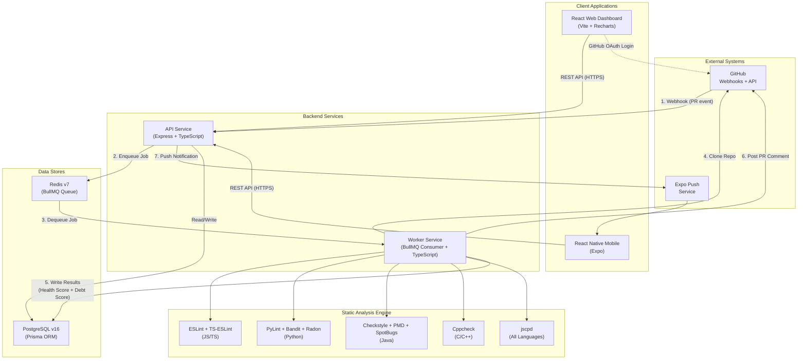

Feasibility Study
<Project Name>

Date

<<Name>>
<<Index No>>

Table of Contents

1. Introduction 
1 Overview of the Project
1.2 Objectives of the Project 
1.3 The Need for the Project 
1.4 Overview of Existing Systems and Technologies
1.5 Scope of the Project
1.6 Deliverables .
2. Feasibility Study 
2.1 Financial Feasibility 
2.2 Technical Feasibility 
2.3 Resource and Time Feasibility 
2.4 Risk Feasibility 
2.5 Social/Legal Feasibility 
3. Considerations 
4. References 

Important instructions 

You should write the report pretending you are giving it to the client of your system; report as a professional document. Do not write the report as a personal assignment submission. i.e. write in the third person (avoiding 'I', 'we' and 'you')

Elaborate the content in each sub section 

    1. Introduction 

1.1 Overview of the Project
This section provides a high level description of the products and/or services of the considered system. It is important that this description captures the most important aspects of the products and/or services that the organization is considering as well as how it may benefit customers and the organization. 

1.2 Objectives of the Project 
This section lists the objectives of the system. Eg: 
The objectives of this project is to-
-	Design and implement … 
-	Provide a …..
-	Automate …

1.3 The Need for the Project 
This section describes the usefulness of the system.
    • Do NOT write that the project is a requirement of CS3202

1.4 Overview of Existing Systems and Technologies
This section should explain similar existing systems that achieve or partially achieve the goals of the proposed system. 
Also describes any considerations the organization must make with regards to technology.  
(software development tools and libraries, database systems).

1.5 Scope of the Project
This section describes the main user roles and list their functionalities within the system.

1.6 Deliverables .
This section describes the main outputs of the system. Eg:
A web based software system/ mobile application/ standalone application for….
A GUI with ……

2. Feasibility Study 
        2.1 Financial Feasibility 
This section provides a description of the financial projections the new initiative is expected to yield versus additional costs.  

2.2 Technical Feasibility

Technical feasibility assesses whether the proposed system can be built using available technologies, tools, and technical expertise. It evaluates whether the required hardware, software, and infrastructure exist to develop, deploy, and maintain the system within the given constraints. This section examines the available techniques for each major technology decision, justifies the selected approach, and confirms that the project is technically achievable.

### 2.2.1 Techniques Available for Development

The following table summarizes the candidate technologies evaluated for each component of the system and indicates the selected choice.

| Component | Candidates Evaluated | Selected | Reason |
|---|---|---|---|
| **Backend Runtime** | Node.js, Python (Django/Flask), Go, Java (Spring Boot) | **Node.js v20 LTS** | Non-blocking I/O ideal for webhook-heavy workloads; shared TypeScript with frontend reduces context-switching; largest npm ecosystem for GitHub integrations [1] |
| **Backend Framework** | Express.js, Fastify, NestJS, Koa | **Express.js v4** | Most mature ecosystem with widest middleware support; extensive documentation and community resources; simpler learning curve for rapid development [2] |
| **Language** | JavaScript, TypeScript, Python, Go | **TypeScript v5** | Compile-time type safety reduces runtime errors; shared across API, Worker, and frontend; Prisma and BullMQ provide first-class TypeScript support [3] |
| **Job Queue** | BullMQ, RabbitMQ, AWS SQS, Celery, Agenda | **BullMQ v5** | Redis-backed with built-in retry, rate limiting, and concurrency control; Bull Board provides a visual dashboard for monitoring jobs; simpler than RabbitMQ (no separate broker process) [4] |
| **Database** | PostgreSQL, MySQL, MongoDB, SQLite | **PostgreSQL v16** | ACID-compliant relational database; advanced indexing (composite, partial) for analytical queries; JSON support for flexible metadata; industry standard for SaaS applications [5] |
| **ORM** | Prisma, TypeORM, Sequelize, Drizzle, Knex | **Prisma v5** | Auto-generated type-safe client from schema; declarative migration system; introspection capabilities; best-in-class TypeScript integration [6] |
| **Cache / Queue Backend** | Redis, Memcached, KeyDB | **Redis v7** | Required by BullMQ; also serves as rate-limit store; supports pub/sub for future real-time features [7] |
| **Web Frontend** | React, Vue.js, Angular, Svelte, Next.js | **React v18 + Vite v5** | Component-based architecture with large ecosystem; Vite provides fast HMR during development; React's ecosystem has mature charting libraries (Recharts); Next.js was considered but adds server-side complexity unnecessary for a dashboard SPA [8][9] |
| **Mobile Framework** | React Native + Expo, Flutter, Swift/Kotlin native | **React Native + Expo v51** | Code sharing with web (TypeScript); Expo simplifies push notification setup via Expo Push API; single language for entire stack [10] |
| **Charting** | Recharts, Chart.js, D3.js, Victory, Nivo | **Recharts** | Built specifically for React; declarative API; supports line charts, area charts, donut charts needed for trend and debt visualizations; lighter than D3.js [11] |
| **VCS Integration** | Octokit, GraphQL API, raw REST | **Octokit (REST)** | Official GitHub client; handles authentication, pagination, and rate limiting automatically; well-documented [12] |
| **Authentication** | GitHub OAuth, Auth0, Firebase Auth, Passport.js | **GitHub OAuth (direct)** | Users already have GitHub accounts; provides repository access tokens needed for API calls; no third-party auth service cost [13] |
| **CI/CD** | GitHub Actions, Jenkins, GitLab CI, CircleCI | **GitHub Actions** | Native integration with the project's GitHub repository; free for public repos; YAML-based workflow definition; supports matrix builds [14] |
| **Containerization** | Docker Compose, Kubernetes, Podman | **Docker Compose v2** | Sufficient for local development with PostgreSQL + Redis; Kubernetes would add unnecessary operational complexity for a two-service system [15] |
| **Logging** | Pino, Winston, Bunyan, Morgan | **Pino** | Fastest Node.js JSON logger; structured output suitable for production log aggregation; pino-pretty for human-readable dev output [16] |

### 2.2.2 Static Analysis Tools Selection

The analysis engine operates at the **language level** rather than the framework level. This is a deliberate design decision: a React app, a Next.js app, and a Vue app are all JavaScript/TypeScript — the same ESLint rules apply to all of them. This approach eliminates the need for framework-specific analysis configurations.

| Language | Category | Candidates | Selected | Justification |
|---|---|---|---|---|
| **JS/TS** | Style & Smells | ESLint, JSHint, JSLint, Biome | **ESLint v10** | Industry standard; extensible plugin system; covers all JS/TS frameworks; flat config since v9 [17] |
| **JS/TS** | Type Analysis | typescript-eslint, tsc --noEmit | **typescript-eslint v8** | Provides type-aware linting rules not available in plain ESLint; catches type-related bugs [18] |
| **JS/TS** | Security | eslint-plugin-security, Snyk, npm audit | **eslint-plugin-security** | Runs inline with ESLint (no separate process); detects common vulnerability patterns [19] |
| **Python** | Style & Smells | PyLint, Flake8, Ruff, Pycodestyle | **PyLint v3** | Most comprehensive Python linter; provides both style and logic error detection [20] |
| **Python** | Security | Bandit, Safety, Semgrep | **Bandit v1.9** | Purpose-built for Python security; AST-based analysis; maintained by PyCQA [21] |
| **Python** | Complexity | Radon, wily, mccabe | **Radon v6** | Provides both Cyclomatic Complexity and Maintainability Index; JSON output for easy parsing [22] |
| **Java** | Style | Checkstyle, Google Java Format | **Checkstyle v10** | Configurable rule sets; works on all Java projects including Spring Boot and Android [23] |
| **Java** | Complexity | PMD, SonarJava | **PMD v7** | Source-level analysis with CyclomaticComplexity rule; includes built-in CPD for duplication [24] |
| **Java** | Security & Bugs | SpotBugs, FindBugs, Error Prone | **SpotBugs v4.9** | Bytecode-level analysis catches runtime bugs that source-level tools miss [25] |
| **C/C++** | All Categories | Cppcheck, Clang Static Analyzer, PVS-Studio | **Cppcheck v2.21** | Open-source; detects undefined behavior, memory leaks, and style issues; no compiler dependency [26] |
| **All Languages** | Duplication | jscpd, PMD CPD, Simian | **jscpd v5** | Cross-language; v5 rewritten in Rust (24–37x faster); supports 150+ languages [27] |

**Why not selected alternatives:**
- **JSHint/JSLint** were not selected because ESLint has superseded them with a more extensible plugin architecture and active maintenance.
- **Flake8/Ruff** were not selected for Python because PyLint provides more comprehensive analysis including logic errors, not just style.
- **Semgrep** was not selected because it requires custom rule definitions and has a steeper learning curve compared to Bandit.
- **SonarJava** was not selected because it requires the full SonarQube server infrastructure.
- **PVS-Studio** was not selected because it is a commercial product with restrictive licensing.
- **Kubernetes** was not selected because the system has only two services (API + Worker), which does not justify the operational complexity of a container orchestration platform.

### 2.2.3 System Architecture Diagram

The following diagram illustrates the end-to-end system architecture showing how data flows from a GitHub webhook event through analysis to the final output.

### 2.2.4 Detailed Description of Selected Technologies

**Node.js v20 LTS [1]** is a server-side JavaScript runtime built on the V8 engine. It uses an event-driven, non-blocking I/O model that is well-suited for handling high volumes of webhook events and API requests concurrently. Node.js was selected over Python (Django) because the entire stack — API, Worker, Web Frontend, and Mobile — can share a single language (TypeScript), reducing context-switching overhead and enabling shared type definitions across services. It was selected over Go because of the significantly larger ecosystem of npm packages for GitHub integrations, job queues, and ORMs.

**TypeScript v5 [3]** adds static type checking to JavaScript. It catches type-related errors at compile time rather than runtime, which is critical for a system that processes webhook payloads with complex nested JSON structures. The Prisma ORM generates TypeScript types directly from the database schema, ensuring that database queries are type-safe throughout the application. TypeScript was selected over plain JavaScript because the cost of type errors in a production webhook system is high — malformed payloads could silently corrupt analysis results without type validation.

**Express.js v4 [2]** is a minimal HTTP framework for Node.js. It provides routing, middleware composition, and error handling. Express was selected over NestJS because NestJS introduces an opinionated module/decorator architecture that adds learning overhead without proportional benefit for a system with approximately 30 REST endpoints. Express was selected over Fastify because Express has a larger middleware ecosystem, particularly for authentication (Passport.js), rate limiting (express-rate-limit), and webhook verification.

**BullMQ v5 [4]** is a Redis-backed job queue for Node.js. It provides reliable job processing with automatic retries, configurable concurrency, job prioritization, and dead-letter queues. BullMQ was selected over RabbitMQ because it does not require a separate message broker process — it uses the existing Redis instance, simplifying deployment. BullMQ was selected over Celery because Celery is Python-based and would require a second runtime in the Worker service. The Bull Board web interface [28] provides a real-time visual dashboard for monitoring job queues, which is valuable for both development debugging and live demonstrations.

**PostgreSQL v16 [5]** is an advanced open-source relational database. It was selected over MongoDB because the data model is inherently relational (users own repositories, repositories have analyses, analyses contain findings) and requires ACID transactions for consistent Health Score computation. PostgreSQL was selected over MySQL because of its superior support for composite indexes, partial indexes, and the jsonb data type for storing flexible analysis metadata. The Prisma ORM [6] generates a type-safe client from the schema definition, enabling compile-time verification of all database queries.

**React v18 [8]** is a component-based UI library. It was selected for the web dashboard because of its mature ecosystem of charting libraries (Recharts), routing solutions (React Router), and state management tools. React was selected over Vue.js because the team has access to more React learning resources and the React Native mobile framework enables component logic sharing between web and mobile. React was selected over Angular because Angular's opinionated module system adds unnecessary complexity for a dashboard application.

**React Native + Expo v51 [10]** is a cross-platform mobile framework. Expo was selected over bare React Native because it provides managed push notification services (Expo Push API), eliminating the need to configure Firebase Cloud Messaging and Apple Push Notification Service separately. Expo was selected over Flutter because it enables TypeScript code sharing with the backend API client and type definitions.

### 2.2.5 Technical Feasibility Conclusion

The project is **technically feasible**. All selected technologies are open-source, actively maintained (verified as of June 2026), and have extensive community documentation. The two-service architecture (API + Worker) is a well-established pattern used by production systems such as GitHub Actions, SonarQube, and Sidekiq. All 11 static analysis tools produce JSON or structured text output that can be parsed programmatically. The GitHub Webhook API and Octokit REST client are mature, well-documented interfaces. No custom hardware, proprietary software, or experimental technology is required.

2.3 Resource and Time Feasibility 

This section describes specific hardware and software requirements / resources and time feasibility for the successful completion of the system development. 

2.4 Risk Feasibility 
This section describes the risks and risk mitigations
Do NOT write that you are not familiar with the technologies, so there is a risk.

2.5 Social/Legal Feasibility 

3. Considerations

This section describes the primary concerns that must be addressed during the design and implementation of the system. Each concern represents a critical quality attribute that directly impacts the usability, reliability, and security of the platform.

### 3.1 Performance

Performance refers to the system's ability to process requests and return results within an acceptable time frame under expected load conditions.

The most performance-critical operation in the system is the code analysis pipeline. When a Pull Request webhook is received, the Worker must clone the repository, execute multiple static analysis tools, compute the Health Score and Debt Score, and persist the results — all within a time window that does not frustrate the developer waiting for feedback.

**Key performance considerations:**
- **Shallow cloning:** The Worker uses `git clone --depth=1` to clone only the latest commit, reducing clone time from minutes to seconds for large repositories [29].
- **Per-tool timeouts:** Each static analysis tool is given a maximum execution time of 2 minutes. If a tool exceeds this limit, it is terminated and the analysis proceeds with the remaining tools.
- **Concurrency control:** BullMQ is configured with a concurrency limit to prevent multiple analysis jobs from consuming all available CPU and memory simultaneously.
- **Database indexing:** Composite indexes on `(repositoryId, createdAt)` enable efficient time-range queries for trend charts without full table scans [5].
- **Target benchmark:** The system should complete analysis of a repository with fewer than 10,000 lines of code within 3 minutes of webhook receipt.

### 3.2 Security

Security refers to the system's ability to protect user data, authenticate requests, and prevent unauthorized access to resources.

Since the system integrates directly with GitHub repositories and processes source code, security is a critical concern. The system handles OAuth tokens, webhook secrets, and potentially sensitive source code.

**Key security considerations:**
- **Webhook verification:** All incoming GitHub webhooks are verified using HMAC-SHA256 signature comparison before processing. Any request with an invalid or missing signature is rejected immediately [30].
- **OAuth token handling:** GitHub OAuth access tokens are stored securely and transmitted only over HTTPS. Tokens are scoped to the minimum required permissions (repository read access and PR comment write access).
- **Input validation:** All API inputs are validated using Zod schemas [31] before processing. Invalid payloads are rejected with descriptive error messages.
- **Rate limiting:** The API implements rate limiting using `express-rate-limit` with a Redis-backed store to prevent abuse. Different limits apply to different routes (e.g., 100 requests/15 minutes globally, 5 manual analysis triggers/5 minutes per user) [32].
- **Temporary file cleanup:** Cloned repositories are stored in temporary directories and deleted immediately after analysis, regardless of whether the analysis succeeds or fails.
- **Bull Board protection:** The queue monitoring dashboard at `/admin/queues` is protected with basic authentication to prevent unauthorized access to job metadata.

### 3.3 Usability

Usability refers to how easily users can learn and operate the system to achieve their goals.

The system targets two distinct user groups: developers who interact primarily with GitHub PR comments, and team leads / project managers who use the web dashboard and mobile app. The system must be accessible to users with varying levels of technical expertise.

**Key usability considerations:**
- **Single-click onboarding:** Users authenticate with their existing GitHub account — no separate registration process is required. Repository linking is performed through a visual picker that lists the user's accessible repositories.
- **Intuitive Health Score:** The 0–100 Health Score is designed to be immediately understandable by non-technical stakeholders. Color-coded indicators (green: 85–100, yellow: 70–84, orange: 50–69, red: 0–49) provide at-a-glance assessment.
- **Contextual PR comments:** Analysis results are posted directly in the GitHub Pull Request where developers already work, eliminating the need to switch to a separate tool.
- **Responsive dashboard:** The web dashboard is designed for screen widths from 1024px to 1920px, ensuring usability on laptops and external monitors.
- **Mobile quick-view:** The mobile app provides a condensed summary screen optimized for quick checks — a team lead can assess repository health in under 10 seconds.

### 3.4 Scalability

Scalability refers to the system's ability to handle increased workload by adding resources without requiring architectural changes.

**Key scalability considerations:**
- **Stateless services:** Both the API and Worker services are stateless — all persistent state resides in PostgreSQL and Redis. This enables horizontal scaling by simply adding more instances behind a load balancer.
- **Independent Worker scaling:** Worker instances consume jobs from the same BullMQ queue. Adding a new Worker instance immediately increases analysis throughput with no coordination required.
- **Database scalability path:** PostgreSQL supports read replicas for separating dashboard read queries from Worker write operations. Connection pooling (via PgBouncer) can be introduced when the number of API instances exceeds the database connection limit.
- **CDN for frontend:** The React web dashboard is a static Single Page Application that can be served via a Content Delivery Network (e.g., Vercel, Netlify), scaling to unlimited concurrent users with edge caching.

### 3.5 Reliability

Reliability refers to the system's ability to continue operating correctly in the presence of failures.

**Key reliability considerations:**
- **Job persistence:** BullMQ persists all jobs to Redis. If the Worker crashes mid-analysis, the job is automatically retried (up to 3 attempts with exponential backoff). No analysis request is lost due to a Worker failure.
- **Health check endpoints:** Both the API and Worker expose a `GET /health` endpoint that reports the status of database and Redis connections. Deployment platforms use this endpoint to detect and restart unhealthy instances automatically.
- **Structured logging:** All services use Pino [16] for structured JSON logging, enabling rapid diagnosis of production issues through log aggregation and search.
- **Graceful degradation:** If one static analysis tool fails (e.g., PyLint crashes on a malformed Python file), the system continues with the remaining tools and computes a partial Health Score rather than failing the entire analysis.
- **Database migrations:** The Prisma migration system ensures that database schema changes are applied consistently across all environments, preventing schema drift between development and production.

### 3.6 Maintainability

Maintainability refers to how easily the system can be modified, extended, or debugged after initial deployment.

**Key maintainability considerations:**
- **Monorepo structure:** All services (API, Worker, Web, Mobile, Database) reside in a single repository with shared TypeScript type definitions, ensuring that API contract changes are immediately visible across all consumers.
- **Type safety:** TypeScript across the entire stack, combined with Prisma's generated types, ensures that refactoring (e.g., renaming a database column) produces compile-time errors rather than silent runtime failures.
- **Modular analysis engine:** Each static analysis tool is wrapped in a standardized adapter interface. Adding support for a new language or tool requires implementing a single adapter without modifying existing code.
- **CI/CD pipeline:** GitHub Actions automatically runs linting, type-checking, and tests on every push, catching regressions before they reach production [14].

4. References 
Refer any data/ information in a standard format (eg. IEEE referencing style)
For different algorithms/ techniques/ theories you can refer text books. 
For tools you can refer web pages. 
For similar work you can refer research paper articles that describe the work.
You may include white paper articles for the description of technologies; web URL for the tool references. When you refer such a web page, you have to indicate the (Accessed on <<date>>)

[1] OpenJS Foundation, "Node.js," [Online]. Available: https://nodejs.org/. (Accessed on 3 July 2026)

[2] OpenJS Foundation, "Express — Node.js web application framework," [Online]. Available: https://expressjs.com/. (Accessed on 3 July 2026)

[3] Microsoft, "TypeScript — JavaScript with syntax for types," [Online]. Available: https://www.typescriptlang.org/. (Accessed on 3 July 2026)

[4] Taskforce.sh, "BullMQ — Premium Message Queue for Node.js," [Online]. Available: https://bullmq.io/. (Accessed on 3 July 2026)

[5] The PostgreSQL Global Development Group, "PostgreSQL," [Online]. Available: https://www.postgresql.org/. (Accessed on 3 July 2026)

[6] Prisma Data, Inc., "Prisma — Next-generation Node.js and TypeScript ORM," [Online]. Available: https://www.prisma.io/. (Accessed on 3 July 2026)

[7] Redis Ltd., "Redis — The Real-time Data Platform," [Online]. Available: https://redis.io/. (Accessed on 3 July 2026)

[8] Meta Platforms, Inc., "React — A JavaScript library for building user interfaces," [Online]. Available: https://react.dev/. (Accessed on 3 July 2026)

[9] E. You, "Vite — Next Generation Frontend Tooling," [Online]. Available: https://vitejs.dev/. (Accessed on 3 July 2026)

[10] Expo, Inc., "Expo — Make any app. Run it everywhere," [Online]. Available: https://expo.dev/. (Accessed on 3 July 2026)

[11] Recharts Contributors, "Recharts — A composable charting library for React," [Online]. Available: https://recharts.org/. (Accessed on 3 July 2026)

[12] GitHub, Inc., "Octokit — Official clients for the GitHub API," [Online]. Available: https://github.com/octokit/. (Accessed on 3 July 2026)

[13] GitHub, Inc., "Authorizing OAuth apps," [Online]. Available: https://docs.github.com/en/apps/oauth-apps/building-oauth-apps/authorizing-oauth-apps. (Accessed on 3 July 2026)

[14] GitHub, Inc., "GitHub Actions — Automate your workflow," [Online]. Available: https://github.com/features/actions. (Accessed on 3 July 2026)

[15] Docker, Inc., "Docker Compose," [Online]. Available: https://docs.docker.com/compose/. (Accessed on 3 July 2026)

[16] Pino Contributors, "Pino — Super fast, all natural JSON logger," [Online]. Available: https://getpino.io/. (Accessed on 3 July 2026)

[17] OpenJS Foundation, "ESLint — Pluggable JavaScript/TypeScript Linter," [Online]. Available: https://eslint.org/. (Accessed on 3 July 2026)

[18] typescript-eslint, "typescript-eslint — Tooling for TypeScript linting," [Online]. Available: https://typescript-eslint.io/. (Accessed on 3 July 2026)

[19] eslint-community, "eslint-plugin-security," [Online]. Available: https://github.com/eslint-community/eslint-plugin-security. (Accessed on 3 July 2026)

[20] PyCQA, "PyLint — Python Code Quality Authority," [Online]. Available: https://pylint.readthedocs.io/. (Accessed on 3 July 2026)

[21] PyCQA, "Bandit — Security linter for Python," [Online]. Available: https://bandit.readthedocs.io/. (Accessed on 3 July 2026)

[22] M. Lacchia, "Radon — Python tool for code metrics," [Online]. Available: https://radon.readthedocs.io/. (Accessed on 3 July 2026)

[23] Checkstyle Contributors, "Checkstyle — Java code style checker," [Online]. Available: https://checkstyle.org/. (Accessed on 3 July 2026)

[24] PMD Contributors, "PMD — An extensible cross-language static code analyzer," [Online]. Available: https://pmd.github.io/. (Accessed on 3 July 2026)

[25] SpotBugs Contributors, "SpotBugs — Find bugs in Java programs," [Online]. Available: https://spotbugs.github.io/. (Accessed on 3 July 2026)

[26] D. Marjamäki, "Cppcheck — A static analysis tool for C/C++," [Online]. Available: https://cppcheck.sourceforge.io/. (Accessed on 3 July 2026)

[27] K. Nickel, "jscpd — Copy/paste detector for source code," [Online]. Available: https://github.com/nicedoc/jscpd. (Accessed on 3 July 2026)

[28] Taskforce.sh, "Bull Board — A UI for BullMQ," [Online]. Available: https://github.com/felixmosh/bull-board. (Accessed on 3 July 2026)

[29] Git Project, "git-clone — Clone a repository into a new directory," [Online]. Available: https://git-scm.com/docs/git-clone. (Accessed on 3 July 2026)

[30] GitHub, Inc., "Securing your webhooks," [Online]. Available: https://docs.github.com/en/webhooks/using-webhooks/securing-your-webhooks. (Accessed on 3 July 2026)

[31] C. Burdo, "Zod — TypeScript-first schema validation," [Online]. Available: https://zod.dev/. (Accessed on 3 July 2026)

[32] express-rate-limit Contributors, "express-rate-limit," [Online]. Available: https://github.com/express-rate-limit/express-rate-limit. (Accessed on 3 July 2026)

